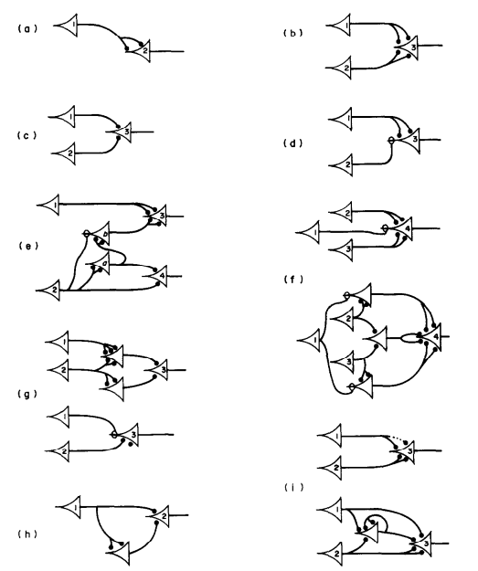
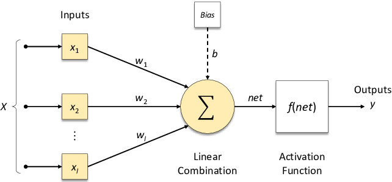
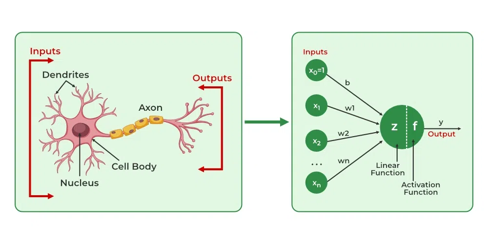
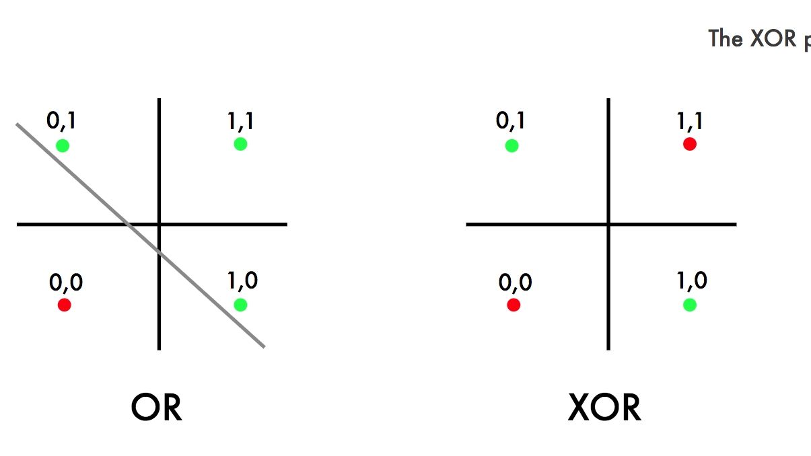
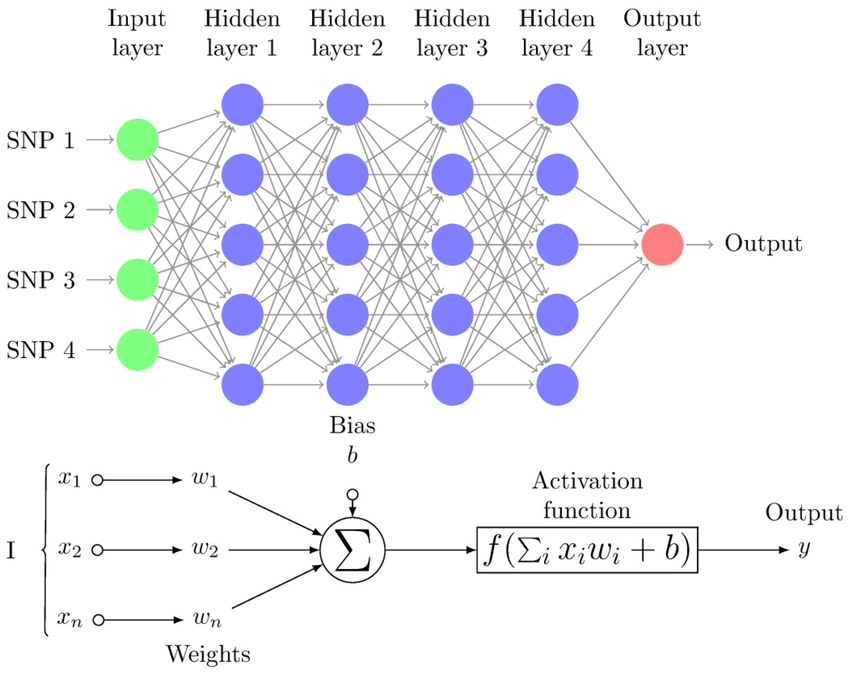

# About the Perceptron

The **Perceptron** represents the very first chapter in the history of artificial intelligence. Its development was sparked by a simple but profound line of questioning:

1.  "How does the human brain learn?"
2.  "It seems to be composed of units called **neurons**."
3.  "Therefore, to create an 'Artificial Intelligence,' we should try to build an **artificial neuron**."

This idea, to model the biological processes of the brain, was the seed from which the field of machine learning grew.

---

## Early Models of Artificial Neurons

In the beginning, AI research was heavily focused on mathematically modeling the human brain to create this "artificial neuron." This led to several key conceptual milestones.

### 1. McCulloch & Pitts Neuron (1943)

[A LOGICAL CALCULUS OF THE IDEAS IMMANENT IN
NERVOUS ACTIVITY , McCulloh and Pitts](https://www.cs.cmu.edu/~epxing/Class/10715/reading/McCulloch.and.Pitts.pdf){: target="_blank"}

This was a highly simplified, foundational model.
* It received **binary inputs** (0 or 1).
* It computed a weighted sum of these inputs.
* It would "fire" (output 1) if this sum exceeded a certain **threshold**, and output 0 otherwise.
* Crucially, McCulloch and Pitts demonstrated that by combining these simple units, one could create any **Boolean logic gate** (like AND, OR, NOT).

### 2. Hebb's Learning Rule (1949)
[The Organization of behavior a neuropsychological theory](https://archive.org/details/in.ernet.dli.2015.168156/page/n3/mode/2up){:target="_blank"}

Donald Hebb introduced a concept that became a cornerstone of learning:
> "Neurons that fire together, wire together."

Inspired by how synapses in the brain strengthen with repeated use, Hebb proposed a learning rule where the **weight** (the connection strength) between neurons is not fixed but changes over time. If two neurons are frequently active at the same time, the connection between them strengthens.

### 3. Rosenblatt's Perceptron (1957)

[The Perceptron](https://www.ling.upenn.edu/courses/cogs501/Rosenblatt1958.pdf){:target="_blank"}

Building on these ideas, Frank Rosenblatt introduced the **Perceptron**. This was not just a static model but a **learning algorithm**. It introduced an automated way for the model to *learn* the optimal weights from data, which is widely considered the beginning of machine learning as we know it.

---

## What is a Perceptron? A Linear Classifier

The Perceptron is, fundamentally, a **linear classifier** for *binary classification*.

This means it learns to separate data into two distinct classes by finding a linear boundary.
* In a 2D space, this boundary is a **line**.
* In a 3D space, it's a **plane**.
* In higher-dimensional spaces, it's called a **hyperplane**.

The Perceptron's job is to learn the "best" line (or hyperplane) to separate the two groups of data points.

---

## Structure of a Perceptron

A Perceptron has several key components that mimic its biological inspiration.

*(img from researchgate)*

* **Inputs ($x_1, x_2, \dots, x_n$):** The features of a single data point.
* **Weights ($w_1, w_2, \dots, w_n$):** Adjustable parameters that represent the *importance* or *strength* of each input.
* **Summation ($\Sigma$):** A weighted sum of the inputs, plus a **bias** term.
* **Activation Function (Step Function):** A function that processes the sum and produces the final output.
* **Output ($y$):** The final prediction (e.g., -1 or 1, or 0 or 1).

---

 **Biological Analogy:**
 

 *(img from GeeksforGeeks)*

 * **Inputs / Weights** are like **Dendrites** (which receive signals of varying strengths).
 * **Summation / Activation** is like the **Nucleus/Soma** (which processes the signals).
 * **Output** is like the **Axon** (which transmits the final signal).

The model we've just described, with one set of inputs and one output, is a **Single-Layer Perceptron (SLP)**. When we stack these perceptrons into multiple layers (with **hidden layers** between the input and output), it becomes a **Multi-Layer Perceptron (MLP)**.

## The Mathematical Model

The Perceptron computes a weighted sum $z$ of its inputs.

\\[ z = w_1x_1 + w_2x_2 + \dots + w_nx_n + b \\]

Where $b$ is the **bias** term. The bias shifts the decision boundary off the origin. We can simplify this by including the bias as a weight $w_0$ whose corresponding input $x_0$ is always 1.

\\[ z = \sum_{i=0}^{n} w_i x_i = \mathbf{w}^T \mathbf{x} \\]

This sum $z$ is then passed through an activation function, which in the classic Perceptron is a **step function** (or *sign function*). This function determines the final output.

$$
h_{\mathbf{w}}(\mathbf{x}) = \text{sign}(\mathbf{w}^T \mathbf{x}) =
\begin{cases}
  1 & \text{if } \mathbf{w}^T \mathbf{x} \ge 0 \\
  -1 & \text{if } \mathbf{w}^T \mathbf{x} < 0
\end{cases}
$$

If the weighted sum is positive or zero, the neuron "fires" and outputs 1. If it's negative, it outputs -1.

---

## Perceptrons as Logic Gates

A Single-Layer Perceptron can represent several basic boolean logic gates. Let's assume inputs $x_1, x_2 \in \{0, 1\}$ and an activation function that outputs 1 if $z \ge 0$ and 0 otherwise.

### AND Gate
Outputs 1 only if $x_1 = 1$ **AND** $x_2 = 1$.
* **Weights & Bias:** $w_1 = 1$, $w_2 = 1$, $b = -2$
* **Logic:**
    * $x_1=0, x_2=0 \to (1 \times 0) + (1 \times 0) - 2 = -2 \to 0$
    * $x_1=1, x_2=0 \to (1 \times 1) + (1 \times 0) - 2 = -1 \to 0$
    * $x_1=0, x_2=1 \to (1 \times 0) + (1 \times 1) - 2 = -1 \to 0$
    * $x_1=1, x_2=1 \to (1 \times 1) + (1 \times 1) - 2 = 0 \to 1$

### OR Gate
Outputs 1 if $x_1 = 1$ **OR** $x_2 = 1$.
* **Weights & Bias:** $w_1 = 1$, $w_2 = 1$, $b = -1$
* **Logic:**
    * $x_1=0, x_2=0 \to (1 \times 0) + (1 \times 0) - 1 = -1 \to 0$
    * $x_1=1, x_2=0 \to (1 \times 1) + (1 \times 0) - 1 = 0 \to 1$
    * $x_1=0, x_2=1 \to (1 \times 0) + (1 \times 1) - 1 = 0 \to 1$
    * $x_1=1, x_2=1 \to (1 \times 1) + (1 \times 1) - 1 = 1 \to 1$

### NOT Gate
Outputs the opposite of the single input $x_1$.
* **Weight & Bias:** $w_1 = -1$, $b = 0$
* **Logic:**
    * $x_1=0 \to (-1 \times 0) + 0 = 0 \to 1$ (Outputs 1 for $z \ge 0$)
    * $x_1=1 \to (-1 \times 1) + 0 = -1 \to 0$

---

## Training a Perceptron

How does the Perceptron *learn* the right weights ($\mathbf{w}$)? It uses a simple iterative algorithm.

### The Perceptron Learning Algorithm
1.  **Initialize:** Start with weights $\mathbf{w}$ (e.g., all zeros or small random values).
2.  **Iterate:** For each training example $(\mathbf{x}_n, y_n)$ from the training set:
    * a. **Predict:** Calculate the output $\hat{y} = \text{sign}(\mathbf{w}^T \mathbf{x}_n)$.
    * b. **Check for Mistake:** If the prediction is wrong ($\hat{y} \ne y_n$), update the weights.
3.  **Repeat:** Loop through the dataset multiple times until no more mistakes are made (the model has converged).

### The Update Rule
The core of the learning is the update rule, which is applied **only when a mistake is made**:

\\[ \mathbf{w} := \mathbf{w} + y_n \mathbf{x}_n \\]

Let's analyze this (assuming true labels $y_n$ are $\{-1, 1\}$):

* **Case 1: False Negative.**
    * The true label is $y_n = 1$.
    * We predicted $\hat{y} = -1$ (because $\mathbf{w}^T \mathbf{x}_n < 0$).
    * The update is: $\mathbf{w} := \mathbf{w} + (1)\mathbf{x}_n = \mathbf{w} + \mathbf{x}_n$.
    * This **adds** the input vector $\mathbf{x}_n$ to the weights. This pushes $\mathbf{w}$ to be *more similar* to $\mathbf{x}_n$, making the dot product $\mathbf{w}^T \mathbf{x}_n$ larger (more positive) and more likely to be correct next time.

* **Case 2: False Positive.**
    * The true label is $y_n = -1$.
    * We predicted $\hat{y} = 1$ (because $\mathbf{w}^T \mathbf{x}_n \ge 0$).
    * The update is: $\mathbf{w} := \mathbf{w} + (-1)\mathbf{x}_n = \mathbf{w} - \mathbf{x}_n$.
    * This **subtracts** the input vector $\mathbf{x}_n$ from the weights. This pushes $\mathbf{w}$ to be *less similar* to $\mathbf{x}_n$, making the dot product $\mathbf{w}^T \mathbf{x}_n$ smaller (more negative) and more likely to be correct next time.

This algorithm is guaranteed to find a solution (a separating hyperplane) *if* the data is linearly separable.

### Loss Function (Perceptron Criterion)
This update rule is effectively performing Stochastic Gradient Descent (SGD) on the **Perceptron loss function**. This loss is zero for correctly classified points and positive for misclassified ones.

\\[ L(\mathbf{w}, \mathbf{x}_n, y_n) = \max(0, -y_n (\mathbf{w}^T \mathbf{x}_n)) \\]

For a misclassified point, $y_n$ and $\mathbf{w}^T \mathbf{x}_n$ have opposite signs, so their product is negative. The loss is then $-y_n (\mathbf{w}^T \mathbf{x}_n)$, which is a positive value. 

For a correct point, the product is positive, so the loss is $\max(0, \text{negative value}) = 0$.

---

## Limitations of the Perceptron

The Perceptron's simplicity is also its greatest weakness.

> A Single-Layer Perceptron can **only** solve problems that are **linearly separable**.

This means it fails spectacularly if the data classes cannot be separated by a single straight line.

### The XOR Problem

*(img from DEVcommunity)*

The most famous example of this limitation is the **XOR (Exclusive OR) problem**.

The XOR gate outputs 1 if the two inputs are different, and 0 if they are the same.

| $x_1$ | $x_2$ | Output |
| :---: | :---: | :----: |
| 0 | 0 | 0 |
| 0 | 1 | 1 |
| 1 | 0 | 1 |
| 1 | 1 | 0 |

If you plot these four points on a 2D graph (with (0,0) and (1,1) as one class, and (0,1) and (1,0) as the other), you will find it **impossible** to draw a *single straight line* to separate the '0's from the '1's.

This limitation, famously highlighted by [Minsky and Papert in 1969](https://papers.baulab.info/papers/Minsky-1969.pdf){:target="_blank"}, led to a significant decline in AI research, an era known as the first "AI winter."

### The Solution: Depth

*(img from ResearchGate)*

The solution to the XOR problem, and the key to unlocking the power of neural networks, is the **Multi-Layer Perceptron (MLP)**.
The figure above shows an MLP with four hidden layers.

By stacking layers of perceptrons and introducing **non-linear activation functions** (like Sigmoid or ReLU), an MLP can learn complex, **non-linear** decision boundaries. An MLP can easily solve the XOR problem, and this architecture forms the foundation of modern deep learning.