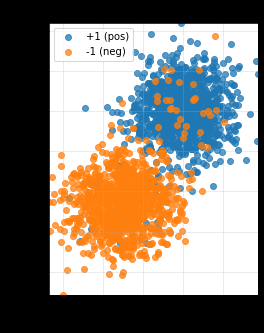
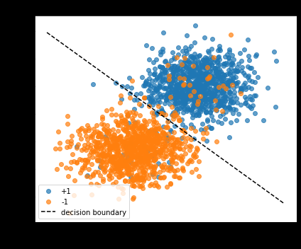

In the previous post, we explored the theoretical foundations of the perceptron algorithm. Now it's time to get our hands dirty and implement it from scratch! We'll walk through three main stages:

1. **Dataset Generation & Preprocessing** - Creating synthetic data to train on
2. **Perceptron Model Implementation** - Building and training our classifier
3. **Results Visualization** - Seeing how well our model performs

Let's dive in and build something concrete.

---

## Dataset Generation & Preprocessing

First, we need data to work with. Instead of loading an external dataset, we'll generate our own 2D points that are linearly separable (well, mostly). This gives us full control over the difficulty of the classification problem.

```python
import math
import random
import numpy as np
import torch
from torch import nn
import matplotlib.pyplot as plt

def make_linear_overlap(
        n_per_class=1000,
        mean=2,
        std=2.5,
        angle_deg=25.0,
        flip_prob=0.05,
        device="cpu",
        seed=42
):
    """Generate a synthetic 2D dataset with two overlapping classes."""
    g = torch.Generator(device=device).manual_seed(seed)

    # Generate positive class centered at (mean, mean)
    pos = torch.randn((n_per_class, 2), generator=g, device=device) * std + torch.tensor([mean, mean], device=device)
    
    # Generate negative class centered at (-mean, -mean)
    neg = torch.randn((n_per_class, 2), generator=g, device=device) * std + torch.tensor([-mean, -mean], device=device)

    # Rotate negative class to create overlap
    theta = math.radians(angle_deg)
    R = torch.tensor([[math.cos(theta), -math.sin(theta)],
                      [math.sin(theta), math.cos(theta)]], device=device)
    neg = neg @ R.T

    # Combine both classes
    X = torch.cat([pos, neg], dim=0)
    y = torch.cat([torch.ones(n_per_class, device=device),
                   -torch.ones(n_per_class, device=device)], dim=0)
    
    # Add label noise to make it realistic
    if flip_prob > 0:
        flip_mask = torch.rand(X.size(0), generator=g, device=device) < flip_prob
        y = torch.where(flip_mask, -y, y)

    # Shuffle the dataset
    perm = torch.randperm(X.size(0), generator=g, device=device)
    X = X[perm]
    y = y[perm]

    return X, y

# Create the dataset
X, y = make_linear_overlap(
    n_per_class=1000,
    mean=5,
    std=3.2,
    angle_deg=25.0,
    flip_prob=0.03
)

print(f"X's shape is {X.shape}\ny's shape is {y.shape}")
```

**Output:**
```
X's shape is torch.Size([2000, 2])
y's shape is torch.Size([2000])
```

### Understanding the Data Generation Process

Let me break down what's happening in the `make_linear_overlap` function:

**Parameters:**
- `n_per_class=1000` creates 1,000 points for each class (2,000 total points)
- `mean=5` centers the positive class around (5, 5) and negative class around (-5, -5), making them well-separated initially
- `std=3.2` controls how spread out the points are—larger values mean more scattered data
- `angle_deg=25.0` rotates the negative class by 25 degrees, creating intentional overlap between classes to make the problem more challenging
- `flip_prob=0.03` randomly flips 3% of the labels to introduce noise, simulating real-world messy data

**Step-by-step breakdown:**

The line `pos = torch.randn((n_per_class, 2), generator=g, device=device) * std + torch.tensor([mean, mean], device=device)` generates the positive class. Here's what happens: `torch.randn` samples from a standard normal distribution (mean=0, std=1), multiplying by `std` stretches the distribution, and adding `[mean, mean]` shifts the center from (0,0) to (5,5).

For rotation, we use `theta = math.radians(angle_deg)` to convert degrees to radians (the unit computers use for angles). The rotation matrix `R` contains `cos` and `sin` terms that mathematically rotate points. When we compute `neg @ R.T`, we're applying this rotation to all negative class points simultaneously.

The labels are created with `torch.ones` for positive class (+1) and `-torch.ones` for negative class (-1), then stacked into a single tensor of shape (2000,).

For label noise, `flip_mask = torch.rand(...) < flip_prob` creates a boolean mask where approximately 3% of values are True. The `torch.where(flip_mask, -y, y)` function flips the label only where the mask is True, turning some +1 into -1 and vice versa.

Finally, `torch.randperm` generates a random permutation of indices from 0 to 1999, which we use to shuffle both `X` and `y` together, ensuring corresponding points and labels stay matched.

---

### Visualizing the Dataset

Before training, let's visualize what our data looks like. This helps us understand if the problem is feasible.

```python
X_np = X.numpy()
y_np = y.numpy()

plt.figure(figsize=(6, 5))
plt.scatter(X_np[y_np == 1, 0], X_np[y_np == 1, 1], label="+1 (pos)", alpha=0.75)
plt.scatter(X_np[y_np == -1, 0], X_np[y_np == -1, 1], label="-1 (neg)", alpha=0.75)

xmin, xmax = X_np[:, 0].min(), X_np[:, 0].max()
ymin, ymax = X_np[:, 1].min(), X_np[:, 1].max()
plt.xlim(xmin, xmax)
plt.ylim(ymin, ymax)
plt.gca().set_aspect('equal', adjustable='box')
plt.grid(True, alpha=0.3)

plt.xlabel("x1")
plt.ylabel("x2")
plt.title("Synthetic 2D Dataset")
plt.legend()
plt.show()
```

**What this visualization shows:**



We convert PyTorch tensors to NumPy arrays with `.numpy()` because matplotlib requires NumPy format. The expression `X_np[y_np == 1, 0]` is fancy indexing that selects all x-coordinates where the label equals +1, and `X_np[y_np == 1, 1]` gets the corresponding y-coordinates. The `alpha=0.75` parameter makes points slightly transparent so we can see overlapping regions. We extract axis ranges using `X_np[:, 0].min()` which takes all rows (`:`) of column 0 (the x-coordinates) and finds the minimum value. Setting `plt.gca().set_aspect('equal')` ensures the x and y axes have the same scale, preventing distortion.

You should see two distinct clusters with some overlap—this is exactly what we want for demonstrating the perceptron's capabilities and limitations.

---

## Building the Perceptron Model

Now comes the exciting part: implementing the perceptron algorithm. We'll create a class that handles both prediction and training.

### Perceptron Class Implementation

```python
class Perceptron(nn.Module):
    """A simple perceptron classifier using the classical update rule."""
    
    def __init__(self, in_dim: int, lr: float = 1.0):
        super().__init__()
        self.w = torch.zeros(in_dim)
        self.b = torch.tensor(0.0)
        self.lr = lr
    
    @torch.no_grad()
    def predict_raw(self, x: torch.Tensor) -> torch.Tensor:
        """Compute raw decision score z = w·x + b"""
        return x @ self.w + self.b
    
    @torch.no_grad()
    def predict(self, x: torch.Tensor) -> torch.Tensor:
        """Predict class labels (+1 or -1)"""
        raw = self.predict_raw(x)
        pos = torch.tensor(1.0, device=raw.device)
        neg = torch.tensor(-1.0, device=raw.device)
        return torch.where(raw >= 0, pos, neg)
    
    @torch.no_grad()
    def fit(self, x: torch.Tensor, y: torch.Tensor, max_epochs: int = 1000, shuffle: bool = True):
        """Train the perceptron using the classical learning rule"""
        n = x.size(0)
        mistakes_per_epoch = []
        
        for epoch in range(max_epochs):
            if shuffle:
                idx = torch.randperm(n)
                x_epoch = x[idx]
                y_epoch = y[idx]
            else:
                x_epoch = x
                y_epoch = y
            
            mistakes = 0
            for xi, yi in zip(x_epoch, y_epoch):
                score = self.predict_raw(xi)
                yi_val = yi.item()
                pred = 1.0 if score.item() >= 0.0 else -1.0
                
                if pred != yi_val:
                    self.w += self.lr * yi * xi
                    self.b += self.lr * yi
                    mistakes += 1
            
            mistakes_per_epoch.append(mistakes)
        
        return mistakes_per_epoch
```

### Breaking Down the Perceptron Class

**The Constructor (`__init__`):**

When we create a perceptron with `Perceptron(in_dim=2, lr=1.0)`, this function runs once. The `super().__init__()` call is essential—it initializes the parent class `nn.Module`, which provides useful PyTorch functionality. We initialize the weight vector `self.w` with `torch.zeros(in_dim)`, creating a tensor like `[0., 0.]` for 2D input. The bias `self.b` starts at 0.0, and `self.lr` stores our learning rate for updates.

**The `@torch.no_grad()` Decorator:**

This decorator appears before each method to tell PyTorch "don't track gradients here." Unlike neural networks that use backpropagation, the perceptron updates weights directly using a simple rule, so gradient tracking would just waste memory and computation.

**The `predict_raw` Method:**

This computes the decision score $z = \mathbf{w} \cdot \mathbf{x} + b$. The `@` operator performs a dot product: if `x = [3, 4]` and `self.w = [1, 2]`, then `x @ self.w = 3*1 + 4*2 = 11`. Adding `self.b` gives us the final raw score.

**The `predict` Method:**

This implements the sign function: if $z \geq 0$, predict +1; otherwise predict -1. We use `torch.where(raw >= 0, pos, neg)` which is like a vectorized if-else statement. This allows us to predict for single points or entire batches at once.

**The `fit` Method - The Heart of Learning:**

This is where learning happens. For each epoch, if `shuffle=True`, we create a random permutation with `torch.randperm(n)` and reorder both features and labels using this permutation—shuffling helps the model generalize better and prevents learning order-dependent patterns.

Inside the training loop, `zip(x_epoch, y_epoch)` pairs each feature vector with its label. For example, if `x_epoch = [[1,2], [3,4]]` and `y_epoch = [1, -1]`, the first iteration gives us `xi = [1,2]` and `yi = 1`.

We compute the prediction, and here's the key perceptron update rule: **only update when wrong**. If `pred != yi_val`, we update with:
- `self.w += self.lr * yi * xi` (the weight update)
- `self.b += self.lr * yi` (the bias update)

For example, if we predicted -1 but the true label is +1, and `xi = [3, 4]`, then `self.w` increases by `1.0 * 1 * [3, 4] = [3, 4]`. This geometric update pushes the decision boundary toward correctly classifying this point.

---

### Training the Model

Let's train our perceptron and see how it learns.

```python
model = Perceptron(in_dim=2, lr=1.0)
max_epochs = 200
history = model.fit(X, y, max_epochs=max_epochs, shuffle=True)

print(f"Learned w: {model.w.detach().cpu().numpy()}")
print(f"Learned b: {float(model.b.item())}")

with torch.no_grad():
    pred = model.predict(X)
    acc = (pred.eq(y)).float().mean().item()

print(f"Train accuracy: {acc * 100:.2f}%")
```

**Understanding the Training Process:**

Creating the model with `model = Perceptron(in_dim=2, lr=1.0)` instantiates our class, running `__init__` to set up fresh weights and bias. Calling `model.fit(X, y, max_epochs=200, shuffle=True)` trains for up to 200 passes through the data.

The `.detach().cpu().numpy()` chain is a common pattern: `.detach()` stops gradient tracking (making it safe to convert), `.cpu()` moves the tensor to CPU memory (NumPy only works with CPU tensors), and `.numpy()` converts from PyTorch to NumPy format. For the bias, since it's a scalar, we use `.item()` to extract the raw Python number.

For accuracy calculation, `pred.eq(y)` creates a boolean tensor showing where predictions match labels—`[True, True, False, ...]`. Converting to float with `.float()` turns it into `[1., 1., 0., ...]`, then `.mean()` computes the average (which equals accuracy), and `.item()` extracts the final number.

---

## Visualizing the Results

The moment of truth—let's see how our perceptron carved up the feature space.

```python
plt.figure(figsize=(6, 5))
X_np = X.numpy()
y_np = y.numpy()

plt.scatter(X_np[y_np == 1, 0], X_np[y_np == 1, 1], c='tab:blue', label='+1', alpha=0.7)
plt.scatter(X_np[y_np == -1, 0], X_np[y_np == -1, 1], c='tab:orange', label='-1', alpha=0.7)

w = model.w.detach().numpy()
b = model.b.item()

# Plot decision boundary
if abs(w[1]) > 1e-8:
    xs = np.linspace(X_np[:, 0].min() - 1, X_np[:, 0].max() + 1, 200)
    ys = -(w[0] / w[1]) * xs - b / w[1]
    plt.plot(xs, ys, 'k--', label='Decision Boundary')
else:
    x_line = -b / (w[0] + 1e-12)
    plt.axvline(x_line, color='k', linestyle='--', label='Decision Boundary')

plt.title("Perceptron Decision Boundary")
plt.xlabel('x₁')
plt.ylabel('x₂')
plt.legend()
plt.tight_layout()
plt.show()
```

**Plotting the Decision Boundary:**



The decision boundary is where $\mathbf{w} \cdot \mathbf{x} + b = 0$. Solving for $x_2$ gives us: $x_2 = -\frac{w_0}{w_1} x_1 - \frac{b}{w_1}$. This is the equation of a line in slope-intercept form.

We check `if abs(w[1]) > 1e-8` to ensure we're not dividing by zero (if $w_1 \approx 0$, the boundary is vertical). For the normal case, `np.linspace` creates 200 evenly spaced x-coordinates spanning slightly beyond our data range. For each x-coordinate, we compute the corresponding y-coordinate using our boundary equation. The `'k--'` format string means black (`k`) dashed (`--`) line.

The else clause handles the edge case of a vertical boundary using `plt.axvline` to draw a vertical line at $x = -b/w_0$.

---

## Wrapping Up

You've just implemented a perceptron from scratch! Here's what we accomplished:

- **Created a synthetic dataset** with controlled overlap and noise
- **Built a perceptron class** with proper initialization and the classical learning rule
- **Trained the model** and tracked its performance
- **Visualized the results** including the learned decision boundary

The perceptron is beautifully simple yet surprisingly effective for linearly separable data. While it has limitations (it can't handle non-linear problems like XOR), understanding it deeply provides a foundation for more complex algorithms like multi-layer neural networks.

Try experimenting with different parameters—increase the overlap, add more noise, or change the learning rate. See how the perceptron's performance degrades and where it breaks down. That's where the fun really begins!