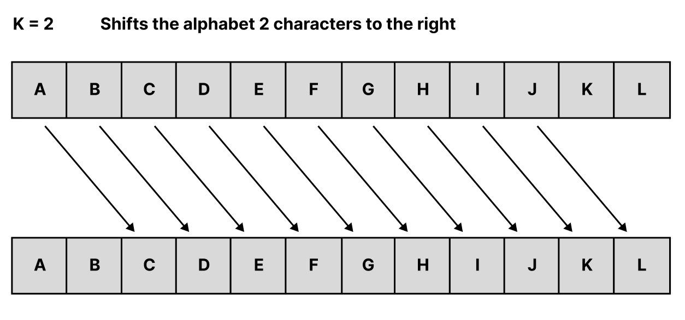
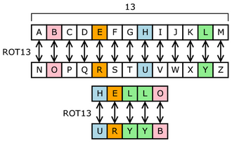
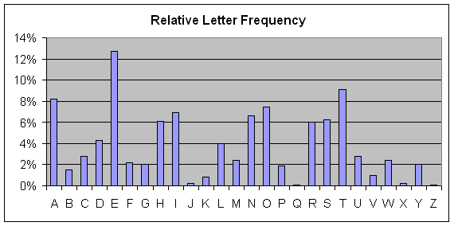
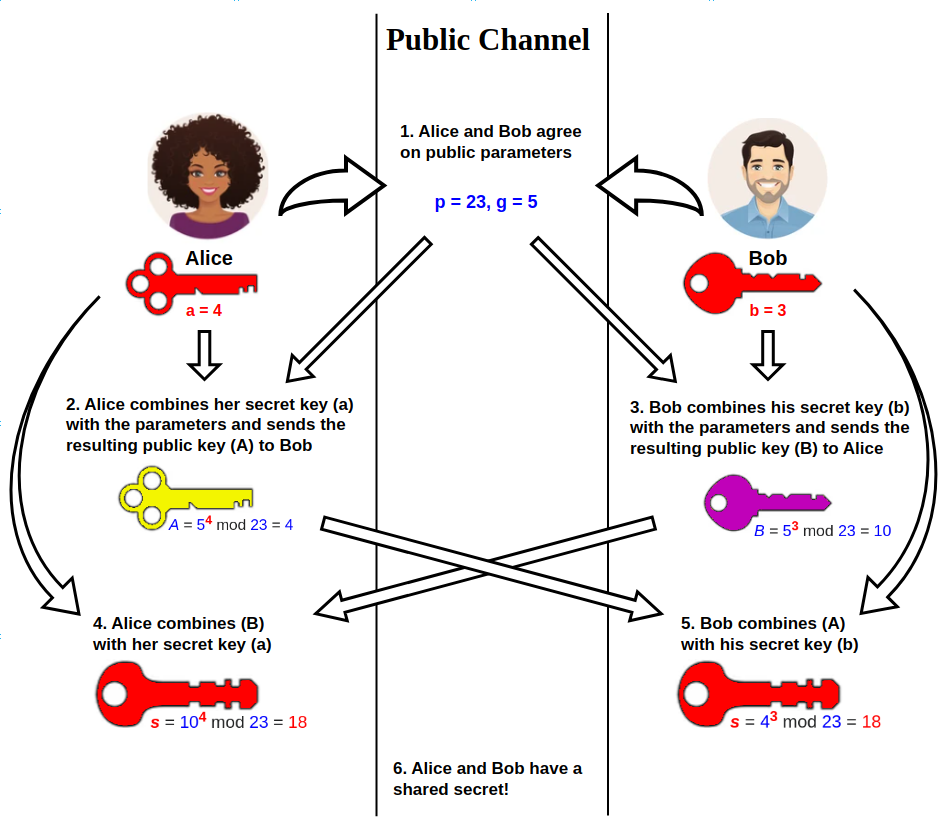
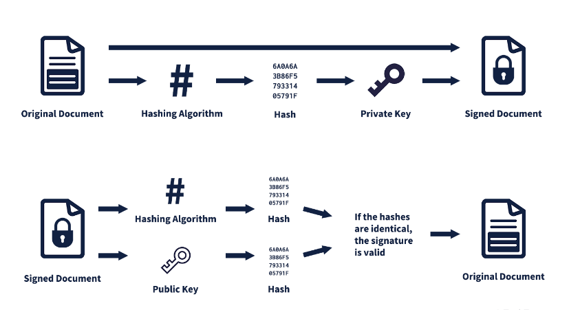

# History
## Caesar cipher & Brute force attack

*(image from vcalc.com)*

In ancient greece, there was early methods of encryption called **Caesar cipher**.
The Caesar cipher is a simple algorithm that simply transforms a given string by shifting it backwards by k. 

- Algorithm : $$E(m) = (M+k) \bmod 26$$

- Number of possibilities : $$25$$

- Attack method : Brute-force attack

Since the alphabet has only 26 characters, simple brute-force attack can easily decrypt it.

## Substitution cipher & Frequency analysis attack

*(image from wikipedia)*
- Number of possibilities : $$26!$$
- Attack method : frequency analysis

The substitution cipher replaces the cipher with a completely random alphabet. Naturally, there are far more variations than the caesar cipher, but even here, a method called frequency analysis exists to break the cipher. 

*(image from wikibooks)*

As the image shown above, there is relative letter frequency in language. In alphabet, the most used letter is 'e', 't' , and so on. The idea of frequency analysis attack is that we can use these frequencies to break the encrypted message. 

Thus, now we know in encryption,
- Key space must be large enough
- Ciphertext should not reveal frequency itself.

But, is this enough?

# Key Distribution problem (~1970s)

|                      | Message privacy (Confidentiality)              | Message integrity / authentication |
|----------------------|-----------------------------------------------|-----------------------------------|
| Symmetric keys       | Symmetric-key encryption                      | Message Authentication Codes (MAC)|
| Asymmetric keys      | Asymmetric encryption (Public-key encryption) | Digital signatures                 |

Let's consider about **Key Distribution problem**.
If we want to lock the message, we need a key.

How Alice and Bob can share the random key using public channel? 

## Symmetric key 

*(image from wikipedia)*

The algorithm called **Diffie-Hellman method** solved this problem. 

If you want to know about specific formula development process, check the [link : Khan academy](https://www.youtube.com/watch?v=M-0qt6tdHzk)

- Key space : $$N^2  (\because \text{for sufficiently large N}, \frac{N(N-1)}{2} \approx N^2)$$
- Fast in encryption and decryption, it is mainly used to protect large amounts of data.
- AES, Disk and file encryption, VPN, Wi-Fi

Still, there is also a attack method called MITM(Man In the Middle Attack)
What if, Eve pretends to be Bob and get all the messages Alice sent?

## Asymmetric key

It is also known as **Web of Trust**.
There are two key pairs : pubilc and private. 
Public key is publicly opened key. But only recipient, can decrypt it using their own private key.

- Key space : $$N$$ (Better scalability)
- Although it provides strong security, it is relatively slow, so it is typically used only for small pieces of data such as session key exchange, authentication, and digital signatures.
- HTTPS(TLS, SSL), email encryption, digital signature, software signature

It can solve the MITM attack. Because, only the right recipient can open it, not adversary. 

Since the public key is widely opened, and anyone can access to it, how can we know that the public key is really made by Alice? 
Are you sure that it is not made by Adversary Eve?

## Digital Signature

*(image from techterms.com)*

Digital signatures were developed to solve this problem.

1. Signing by CA : Certification Authority
- Apply Hash algorithm to original document and get Hash value.
- Encrypt the hash value itself using private key of CA.

2. Verifying
- Recipient apply hash algorithm to the signed document and get hash value.
- Recipient get a second hash value by decrypting the signed document using public key of CA.
- Compare these two values, and if it's identical then it proves the **Integrity** and **Authentication**

# Conclusion
An Ideal Secure Channel needs to meet 3 conditions.
- Data privacy
- Data integrity
- Data authenticity

In the past, we use the infinite process loop 
build -> break -> fix, and the loop per se was primitive.

But in modern cryptography, 
It has been developed on a rigorous and strict mathematical foundation.