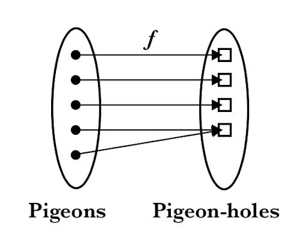

# Hash Function
## Definition
Hash function is a function that maps data of arbitrary length to data of fixed length.

- Compressing : Hash function always outputs a fixted-length output($Y$), regardless of the size of the input data($M$). For example, whether hashing a 1KB text file or a 10GB movie file, the **SHA-256** hash function always produces a 256-bit output.
\\[ |M| \gg |y| \\] M is input, and y is an output(digest)

- Deterministic : Always returnsthe same result for the same input.

- Keyless function : Doesn't require a key. Anyone who know the algorithm can calculate a hash value for any data.

- Collision : The input types might be nearly infinite, but the output types are finite ($2^{256}$ all possible representations in 256 bits.). There is **always** two different inputs mapping to the same output. This is also called as Pigeonhole Principle.
 

*img from Jørgen Veisdal*

Example.

- MD5 : $ \\{ 0,1 \\}^{\<2^{64}} \to \\{ 0,1 \\}^{128} $
- SHA1 : $ \\{ 0,1 \\}^{\<2^{64}} \to \\{ 0,1 \\}^{160} $
- SHA2-256 : $ \\{ 0,1 \\}^{\<2^{64}} \to \\{ 0,1 \\}^{256} $
- SHA2-512 : $ \\{ 0,1 \\}^{\<2^{128}} \to \\{ 0,1 \\}^{512} $

---

Some practice using python: 

## Use-cases
1. Data integrity : If adversary modifies data $D$ to $D'$ in the website, user can know that this file has somehow modified by comparing the hash value written in website.

2. PW authentication : When you register your (ID, PW) , server stores as (ID, H(PW)). Even if adversary sees the server's data, it cannot recover pass. Hash function is only one-way function.

# Three properties of Cryptographic Hash Function
## 1. Preimage-resistance
**Given a hash value(y)**, it is difficult to find any pre-image $m \in \mathbb{M}$ such that $y = H(m)$.

Preimage-resistance is required for Password Aurthentication.
- The goal of adversary is to find out PW with given Hash value. If Hash is pre-imgae resistance, adversary cannot get an original PW value. 

Non-example:
- Mod 10 : $\mathbb{Z} \to \mathbb{Z_{10}}$. Given digest($y$), it is easy to find the exact pre-image. Such as : $Mod10(m) = 6$, and $m$ can be $6,16,26,36 ...$
- Most-significant bit : $ \\{ 0,1 \\}^n \to \\{ 0,1 \\}$. Given digest($y$), it is also easy to find the exact pre-image. Such as : $MSB(m) = 1$ with input $n = 4$, and $m$ can be $1101, 1110, 1011...$

## 2. Second Pre-image resistance
**Given a value of $y,m$ such that $y = H(m)$**, it is difficult to find another pre-image that comes out with same digest. $$y=H(m')$$

Second pre-image resistance is required for data integrity.
- Adversary is given $m, H(m)$ , the goal of adversary is to find out $m'$ such that comes out with same digest. $H(m') = y$
If hash is second pre-image resistance, adversary cannot do that. 

Non-example:
- Mod 10: With given condition that $Mod10(14) = 4$, can u find another input that comes out with the same digest? **YES!!** It can be $4,24,34,44...$
- Most-significant bit : With given condition that $$MSB(101)=1$$, u can also find another input that comes out with the same digest. $$1101, 11101, 10111...$$

## 3. Collision resistance
Collision itself must exists (Hash is compressing function), but it has to be difficult to find two different messages $m_1, m_2$ such that $H(m_1) = H(m_2)$.

The adversary starts with no conditions. It simply needs to find any two pairs that collide.

Without collision resistance, this can be possible:
- Malicious contractor sends the hash message that Hash(I will give you \\$1000), and then after successfully gets the money, malicious contractor can just re-send the message for confirmation Hash(I will give you \\$10) that outputs the same digest. 

# Output length
If the output is too small, Adversary can just break it by brute-force attack.

All secure hash functions are designed to have output length $\geq 256$ bits.

- $\\{0,1\\}^n -> \\{0,1\\}$ : When the output length is 1 bit, there is no resistance at all. It takes only 2 attempts.
- $\\{0,1\\}^n -> \\{0,1\\}^{10}$ : When the output length is 10 bit, the number of possible output value is $2^10 = 1024$. This is also an easy task for modern computer. 
- $\\{0,1\\}^n -> \\{0,1\\}^{100}$ : Now the number of possible output value is $2^100$. This is infeasible with all of computing power. So, 100 bit of output may satisfy pre-image resistance.

But why do hash functions have to output greater than 256 bits? why not 128 bits? 

## Birthday Paradox
- How many people in a room must there be to ensure (100%) that two people share the same birthday?
    - **366 or 367**

- Question 2: How many people in a room must there be to ensure that the probability of two people sharing the same birthday exceeds $50%$?
    - **$\sqrt{365} \approx 19$**

This paradox shows how our intuition differs from the actual probability. 
Why is the probability so high with such a small number of people? 

The key is not to find "people with the same birthday as me," but "pairs with the same birthday, regardless of the combination." As the number of people increases, the number of "pairs" to compare grows exponentially, and the probability of collisions increases rapidly.

**In a hash function with $N$ outputs, the number of attempts required to find a collision with a 50% probability is not $N$, but approximately $\sqrt{N}$**

So, let's get back to the question. Why 128 bit is not enough?
- Pre image attack : To find a pre-image , adversary needs to try $2^{128}$ attempts. This is quite impossible. 
- Collision attack : To find a collision regardless of the combination, it needs only $\sqrt{2^{128}} = 2^{64}$. And it's considered as feasible for attackers with massive computing power such as nation-states or large corporations. 

## Summary
When aiming for n-bit security, which requires $2^n$ or more operations,

The **MINIMUM** requirements are:
- Pre-image resistance : Output length must be at least n bits.
- Collision resistance : Output length must be at least 2n bits. ($ \\because $ Birthday attack )

Since this is a **MINIMUM** requirements, even if a hash function satisfies the conditions above, it may not provide resistance.

## Example 
Let's have a look about [MD5](https://en.wikipedia.org/wiki/MD5) algorithm. (1990~2004)

MD5 produces 128-bit digest. As we learned above, to perform collision attack adversary needs to try $2^{64}$ attempts.
$2^{64}$ attempts per se is feasible to break in a year with 500 computers.

Also, due to the structure of the algorithm, it has been found that MD5 can be attacked with much fewer than $2^{64}$ attempts.

Conclusion: This MD5 example shows that for a cryptographic hash function to be secure, it must (1) have a sufficiently long output length, and (2) at the same time, the internal algorithm design itself must be free of flaws.

