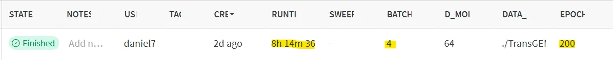
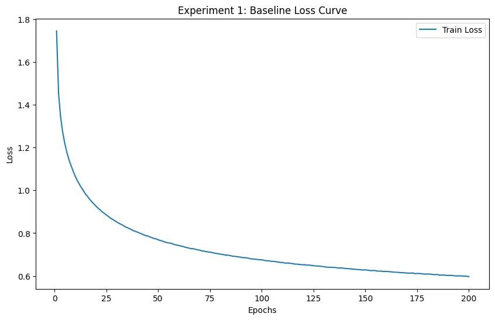
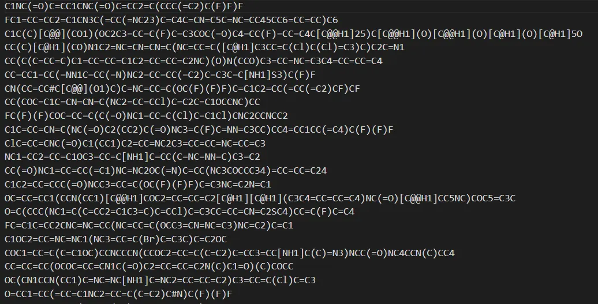
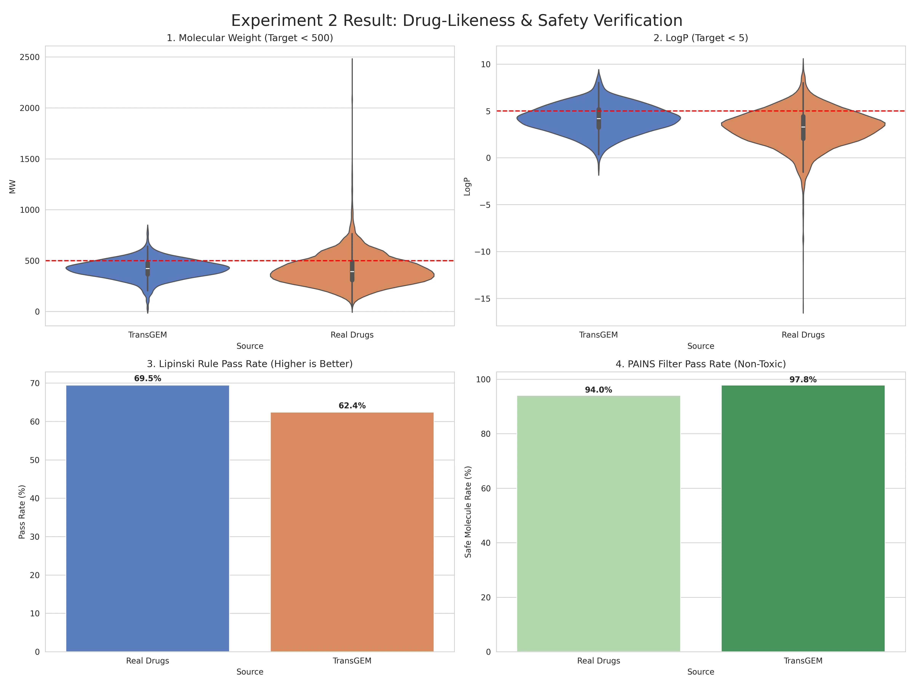
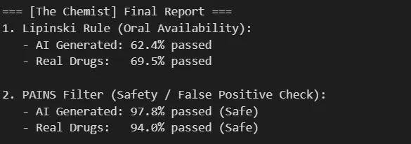
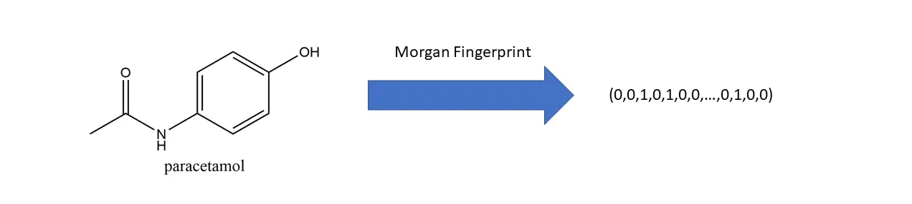
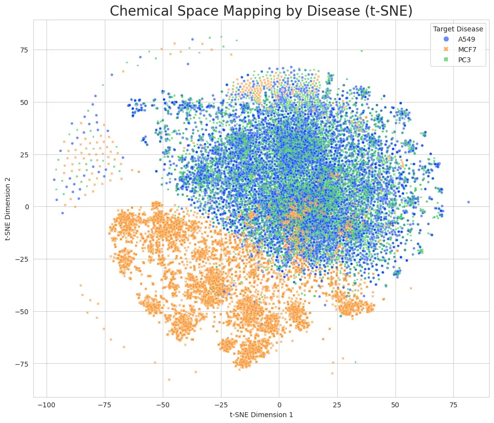
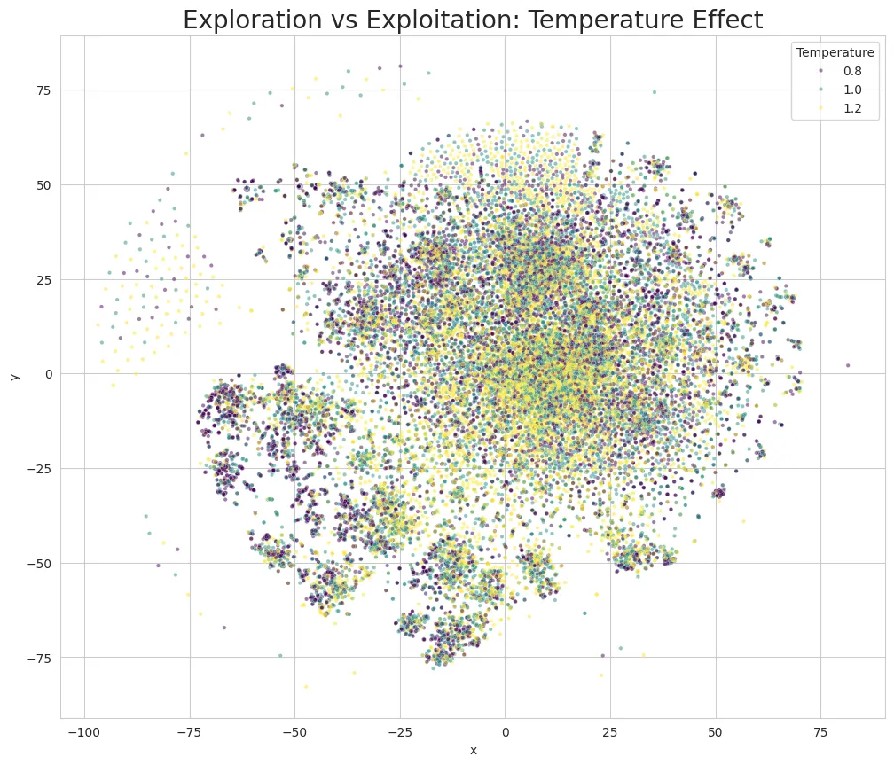
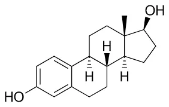
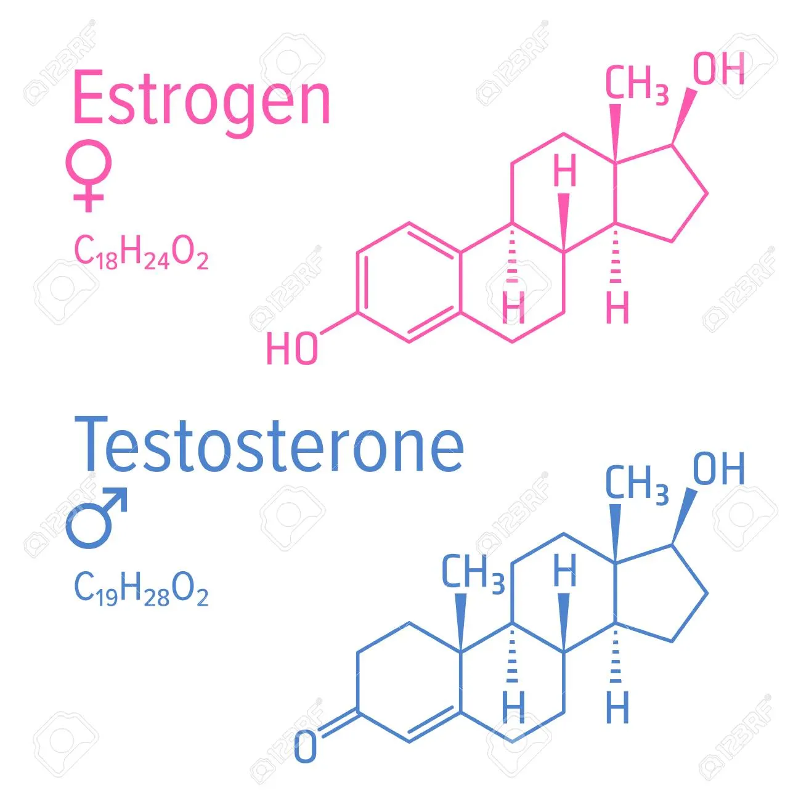

# Common Experimental Setup

Unless otherwise specified, hyperparameters such as learning rate and number of layers follow the values used in the original paper.

- **GPU**: RTX A5000
- **Model**: TransGEM
  - **Input (Prompt)**: Gene expression phenotype data
  - **Process**: Transformer Decoder interprets this information through Attention Mechanism
  - **Output (Generation)**: Generates chemical formulas (SELFIES/SMILES) of drug molecules character by character

While AlphaFold is known for predicting 3D protein structures, TransGEM differs in that it analyzes disease phenotypes to design novel compounds through De Novo Design.

---

# Experiment 1: Baseline Model (Reproduction)

**Objective**: Follow the exact settings from the TransGEM paper to verify that the model trains properly and establish benchmark performance.

**Settings (identical to paper)**:
- Gene Embedding: 10-fold binary
- Optimizer: Adam
- Epochs: 200
- Batch size: 4
- Gene dimension: 978 × 10

The subLINCS dataset contains phenotype data for 978 level-3 genes, which are converted to 10-fold binary, resulting in a dimension of 978 × 10.

**Results**: 


The loss successfully decreased from 1.74 to 0.5.

## Pre-processing the data


The most effort in this experiment went into data preprocessing. When feeding regular floating-point values, the model struggles to learn subtle differences. The paper proposes Tenfold-Binary Embedding to address this issue.

Upon examining the data, I found that the `gene_e` column contained expression values for 978 genes in an unusual string format (using `//` as a delimiter). 

I parsed this and converted it into 10-bit binary vectors following the paper's formula, expanding the input dimension to [978 genes × 10 dimensions]. This implements the paper's core strategy to reduce information sparsity and improve learning efficiency.

Through this preprocessing, the model receives rich information in 9,780 dimensions, enabling it to learn even subtle drug responses.

**Preprocessing Steps**:
- \[Step 1\]: Raw phenotype data values from subLINCS.csv
- \[Step 2\]: Parsing based on `//` delimiter
- \[Step 3\]: Converting parsed float values to tenfold binary

---

# Experiment 2: Drug-likeness Assessment

**Limitations**: The original paper relied solely on statistical metrics like QED and SA scores.

- **QED (0~1)**: Measures whether the molecule is drug-like. However, a high QED score is just a statistical measure—even with high QED, the molecule may not be absorbed in the stomach.
- **SA (1~10)**: Measures synthetic accessibility in the laboratory. However, ease of synthesis doesn't guarantee a good drug.

## **Additional Metrics**:

### Lipinski's Rule of 5 (1997) - Oral Bioavailability

Four physical conditions that oral drugs must meet (called "Rule of 5" because the numbers relate to 5):

1. **Molecular Weight**: ≤ 500 Da
   - Must be small enough to pass through intestinal cell membrane pores. Above 500 Da causes blockage.

2. **Lipophilicity (LogP)**: ≤ 5
   - If LogP is too high (e.g., 8): Only dissolves in fat, cannot enter blood → accumulates in body
   - Should be moderate (2~3) to pass through lipid membranes (intestinal barrier, cell walls) and dissolve in blood

3. **H-bond Donors**: ≤ 5

4. **H-bond Acceptors**: ≤ 10

**Lipinski Metric Design**:

To be more stringent, I used AND operators. If a molecule passed 3 criteria but failed 1, it was counted as failed.

```python
lipinski_pass = (mw <= 500) and (logp <= 5) and (h_donors <= 5) and (h_acceptors <= 10)
```

The overall pass rate is calculated as:

$$
\text{Pass Rate} = \frac{\text{Number of molecules satisfying all 4 conditions}}{\text{Total molecules (1000)}} \times 100
$$

### PAINS Filtering (Removing False Positives)

Some molecules don't actually cure diseases but stick to experimental equipment (sensors), giving false positive signals. These are called PAINS (Pan-Assay Interference Compounds). Forbidden chemical structures are classified and stored as SMARTS patterns.

- **SMILES**: String representation of molecular structure (like 010-1234-5678)
- **SMARTS**: Pattern definition for molecules (like \d{3}-\d{4}-\d{4})

In code, I used the `rdkit.Chem.FilterCatalog` library, which stores hundreds of forbidden chemical substructures classified as PAINS.

```python
from rdkit.Chem import FilterCatalog

params = FilterCatalog.FilterCatalogParams()
params.AddCatalog(FilterCatalog.FilterCatalogParams.FilterCatalogs.PAINS)
pains_filter = FilterCatalog.FilterCatalog(params)

def check_pains(mol):
    if pains_filter.HasMatch(mol):
        return False  # PAINS detected
    return True  # No PAINS detected: count only these
```

$$
\text{Pass Rate} = \frac{\text{Sum of True (1)}}{\text{Total Count (1000)}} \times 100
$$

```python
df_gen['PAINS_Pass'].mean() * 100
```

**Purpose**: Are the generated molecules chemically valid structures? Can they be used as actual drugs?

**Originality**: Beyond the paper's QED/SA scores, rigorous chemical validation was performed using Lipinski's Rule of 5 and PAINS filtering.

## Implementation:

1. **Data Generation**: Generated 1,000 molecules targeting PC3 (prostate cancer) as a .txt file
   - subLINCS.csv contains phenotype data for 978 genes related to prostate cancer (PC3)
   - Converted to tenfold binary, expanding to 9,780 dimensions
   - Fed into TransGEM model for inference
   - Repeated this process 1,000 times in a loop to generate 1,000 different molecular SMILES structures
   

2. **Using RDKit**:
   - Calculated Lipinski metrics: MW, LogP, H-Donor/Acceptor
   - Calculated PAINS

3. **Visualized**: Compared with FDA-approved drug distributions



**Results**: TransGEM-generated molecules showed a Lipinski Rule pass rate of 62.4%, very similar to the actual subLINCS dataset drug pass rate of 69.5%, with only a 7% difference.

This suggests the model isn't simply generating random combinations but has learned and incorporated the physicochemical constraints inherent in the training data (actual drugs).

---

# Experiment 3: Diversity and Specificity

**Motivation** : Does the model just copy the same things repeatedly? Does it truly propose creative structures?

**Originality**: Explored optimal diversity ranges by controlling temperature through Temperature Sampling.

**Implementation**:
- Generated with Temperature settings of 0.8 vs 1.0 vs 1.2
- Analyzed diversity of each group
- Checked overlap between drugs for disease A and disease B

**Hypothesis**: If TransGEM properly understands diseases, drugs for prostate cancer, lung cancer, and breast cancer should have different chemical structures.

## Experiment:

**Mass Production**: Generated 30,000 drugs each for 3 types of cancer, totaling 90,000 drugs.
- Batch size: 100
- Three cancers:
  - PC3: Prostate cancer
  - A549: Lung cancer
  - MCF7: Breast cancer

To check similarity between drug data, they need to be embedded as vectors. I used the Morgan fingerprint method.



**Motivation**: Using traditional SMILES methods produces strings like `CC(C)C(C)NCC1(O)COC=C2C(CNC(C)CC=CC)=CC=C2C`, which cannot be used for similarity checks. A numerical embedding method is needed.

**Morgan Algorithm**:
1. Center on each atom in the molecule and examine neighbor atom structures within a radius of 2 bonds
2. Pass that structure through a hash function to convert to a specific number
3. Perform modulo operation on that number with 1024
4. Mark the corresponding position as 1 in a 1024-bit array
5. Results in a bit vector like [0,1,0,1,1,0...], convenient for similarity checks

```python
fp = AllChem.GetMorganFingerprintAsBitVect(mol, 2, nBits=1024)
```

Used t-SNE dimensionality reduction technique to plot in 2D: 1024 dimensions → 2 dimensions

Mixed different temperatures for diversity:

```python
# Temperature list in CONFIG: [0.8, 1.0, 1.2]
for disease in CONFIG['target_cells']:
    for temp in CONFIG['temperatures']:
        # Batch generation loop
        probs = torch.nn.functional.softmax(next_token_logits / temp, dim=-1)
```

**Mapping**: Extracted features from 90,000 generated molecules and visualized on a 2D map (t-SNE)




**Validation and Results**:


**Left**: Average Tanimoto Similarity (0~1) - Degree of shared chemical properties
- Diagonal elements aren't 100.0 due to internal diversity
- For example, element (2,2) comparing MCF7 vs MCF7 represents the average of comparing MCF7 drug1 vs drug2, drug2 vs drug3, etc.

**Right**: Similarity check - Testing for exact matches
- A549 (lung cancer) vs MCF7 (breast cancer): 0.0%
- MCF7 (breast cancer) vs PC3 (prostate cancer): 0.0% → No issues with data separation from breast cancer drugs
- A549 (lung cancer) vs PC3 (prostate cancer): 0.4% (almost completely separated)
  - Out of 30,000 drugs each, only 0.4% (120 molecules) were completely identical between lung and prostate cancer drugs

**Why? (Hypothesis)**:

1. **Dimensionality Reduction Issue**: While reducing from 1024D to 2D caused overlap in t-SNE visualization, only 0.4% were actually identical molecules. TransGEM recognized disease similarity and created similar-style drugs, but quantitatively proved it generated different molecules specific to each disease.

2. **Biological Characteristics**:



Above is Steroid.



   - **Steroid Structure**: MCF7 breast cancer grows on estrogen, so drugs need a fake key (like Tamoxifen) to bind to estrogen receptors instead of estrogen. Estrogen has a special 4-ring steroid backbone structure. Therefore, drugs mimicking this must have similar unique structures.
   - **PC3 (prostate cancer) and A549 (lung cancer)** lack hormone receptors and only proliferate through signals like KRAS mutations.

This experiment demonstrated that TransGEM-generated drugs show originality across different diseases, proving the model has a deep understanding of the biological mechanisms of diseases.