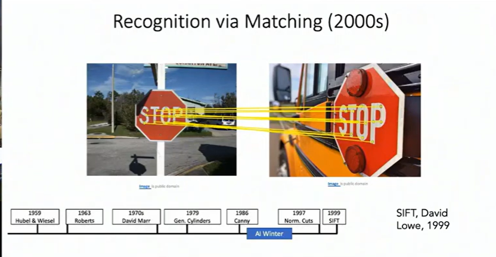
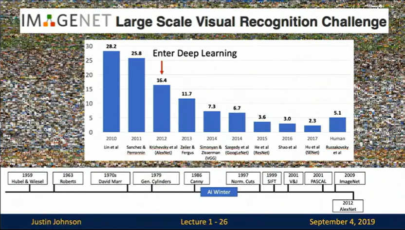
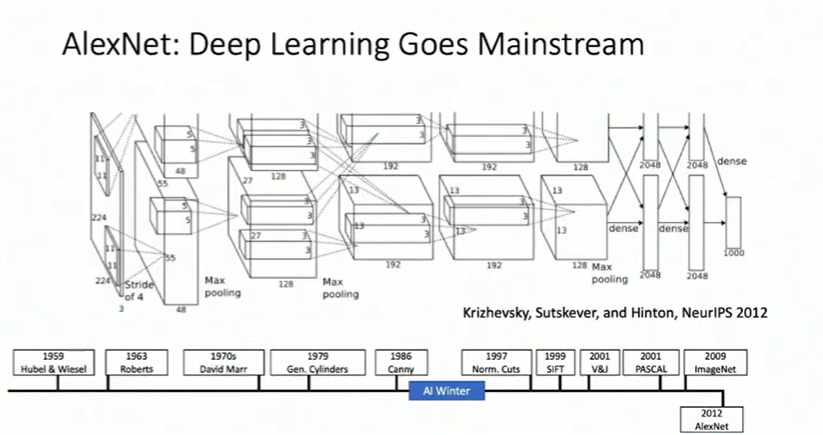
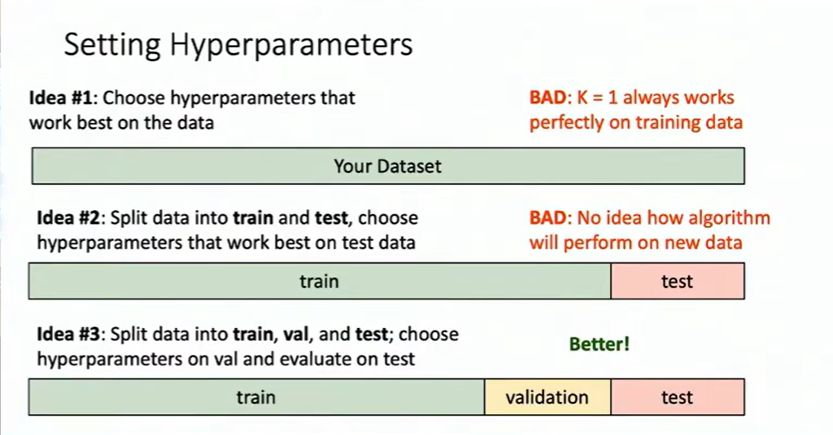
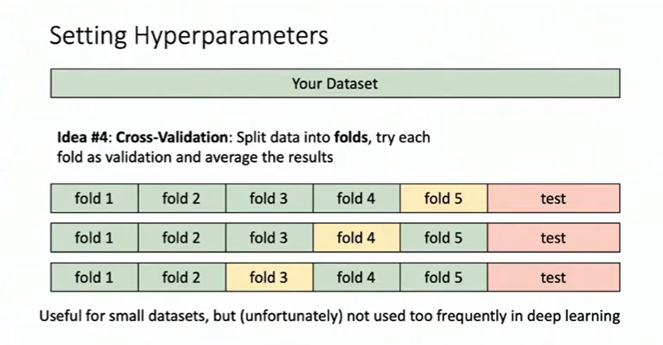

This post summarizes key insights from EECS 498-007: Deep Learning for Computer Vision, Lectures 1 and 2.

# Lecture 1: A Brief History of Computer Vision



---

## The Building Blocks: How Vision Actually Works

### The Groundbreaking Hubel & Wiesel Experiment (1959)


Back in 1959, two neuroscientists did something quite remarkable – they stuck electrodes into a cat's visual cortex and watched what happened when they showed the cat different images. What they discovered fundamentally changed how we understand vision.

The brain doesn't just "see" an image all at once. Instead, it processes visual information in a hierarchical way:
- **Simple cells** detect basic features like edges and lines
- **Complex cells** combine these into shapes and patterns
- Higher-level processing eventually recognizes complete objects

This was a huge deal because it revealed that vision isn't a single step – it's a cascade of increasingly complex pattern recognition. Sound familiar? That's because modern neural networks follow this exact same principle.

## The Long Road: Feature Engineering Era (~1960s-2012)

### The AI Winter Arrives

In 1969, Marvin Minsky and Seymour Papert published "Perceptrons," mathematically proving that single-layer perceptrons couldn't solve the XOR problem. This seemingly technical limitation triggered what we now call the "AI Winter" – a period where funding dried up and many researchers abandoned neural networks entirely.

But research didn't stop completely. Geoffrey Hinton kept the flame alive in the 1980s by developing the backpropagation algorithm, which finally made training multi-layer networks feasible. Then in 1998, Yann LeCun deployed LeNet to read handwritten zip codes on mail, proving that neural networks could work in the real world.

### When Humans Designed the Features

Through the 2000s, the mainstream approach wasn't neural networks – it was **feature engineering**. Researchers manually designed algorithms to extract meaningful patterns from images:

**SIFT (1999)**: 
Found image features that stayed consistent even when you rotated, scaled, or changed the lighting of an image. This was huge for matching images or tracking objects.

**Viola-Jones (2001)**: 
Used the simple observation that eyes are typically darker than the surrounding face region to create the first real-time face detector. This is what powered those face-detection rectangles in your old digital camera!

**HOG (2005)**: Analyzed the direction of pixel intensity gradients to detect pedestrians. Instead of looking at raw pixels, it asked "which way are the edges pointing?" and turned that into a histogram.

These approaches worked, but they had a fundamental limitation: humans had to manually design features for every new problem. Want to detect cars instead of pedestrians? Start over. New lighting conditions? Tweak everything. It wasn't scalable.

## The Revolution: When Everything Changed (2012)





In 2012, everything exploded at the ImageNet Challenge. A team led by Alex Krizhevsky submitted "AlexNet," a deep convolutional neural network that crushed the competition – dropping the error rate from 26% to 16% overnight.

This wasn't just an incremental improvement. It was a paradigm shift that happened because three crucial elements aligned:

1. **Data**: ImageNet provided millions of labeled images – way more than anyone had worked with before
2. **Algorithms**: Convolutional Neural Networks (CNNs) proved they could learn features automatically, no human design needed
3. **Hardware**: GPUs turned out to be perfect for training neural networks, making what was once impossible suddenly feasible

Researchers call this a "perfect storm" – the moment when everything came together.

## The Semantic Gap: What We Still Can't Do

Here's a thought experiment: Look at a photo of two people standing on a bathroom scale. One person is in front, one behind. You immediately understand what's happening – the person behind is sneakily putting their foot on the scale to make the front person think they weigh more. You might even laugh at the prank.

Now ask an AI what it sees: "person, scale, bathroom." 

That's it. No understanding of the prank, the spatial relationships, or why someone might laugh. This gap between what computers can detect (pixels, objects) and what humans understand (context, intention, humor) is called the **semantic gap**.

We've made incredible progress, but bridging this gap remains one of computer vision's greatest challenges.

---

# Lecture 2: Image Classification Deep Dive



---

## What Is Image Classification?

At its core, image classification is deceptively simple: given an image, assign it a category label. Input an image of a cat, output "cat." But this simplicity is misleading – it's actually one of the hardest problems in computer vision.

Why does it matter? Because image classification is a building block for almost everything else:
- **Object detection**: Run a classifier on different parts of an image to find where objects are
- **Image captioning**: Repeatedly classify to generate "a man riding a horse"
- **Game playing**: Treat the board state as an image and classify next moves

## The Core Challenge: Same Image, Different Pixels

Here's the brutal reality: to a computer, images are just grids of numbers. A 800×600 color image is 800×600×3 = 1,440,000 numbers between 0 and 255. That's all the computer sees.

When you slightly rotate the camera angle, every single one of those numbers changes. But to you? It's obviously still the same cat. This is the semantic gap in action.

The challenges multiply:
- **Viewpoint**: Same cat, different angle, completely different pixel values
- **Illumination**: Turn on a light and every pixel changes, but it's still the same scene
- **Occlusion**: You see a tail sticking out from under a couch cushion and think "cat" – but why? It could be a raccoon. You're using context and common sense, not just visual evidence
- **Intra-class variation**: Different cats look radically different, yet they're all "cats"
- **Fine-grained categories**: A Persian cat vs. a Siamese cat – very similar visually, different categories

## The Old Way: Rule-Based Programming

You might think: "I'll just write rules! Cats have pointy ears, whiskers, and..."

This doesn't work. Consider:
- Cats without visible ears? 
- What exact angle defines "pointy"?
- How do you code "usually has whiskers"?
- Now do this for galaxies. And medical scans. And...

You see the problem. It's not scalable, it's brittle, and you end up hardcoding your entire knowledge of the world, which is impossible.

## The Machine Learning Way

Instead, we let data do the teaching:

```python
def train(images, labels):
    # Learn patterns from examples
    return model

def predict(model, test_image):
    # Apply learned patterns
    return prediction
```

This is fundamentally different from traditional programming. We're not telling the computer "how" to recognize cats – we're showing it thousands of cat examples and letting it figure out the patterns.

## Common Datasets

Before diving into algorithms, let's talk about the data we use:

**MNIST** (28×28 grayscale images, 10 digit classes)
- Often called the "Drosophila of computer vision" (fruit fly of CV)
- Almost everything works on MNIST, so it's more of a sanity check than a real benchmark
- Historical significance: used for reading checks in the 1990s

**CIFAR-10** (32×32 color images, 10 classes)
- Small enough to train quickly, hard enough to be meaningful
- Categories: airplane, automobile, bird, cat, deer, dog, frog, horse, ship, truck
- The sweet spot for homework assignments

**CIFAR-100** (32×32 color images, 100 classes)
- Same idea as CIFAR-10, but more challenging with 100 categories

**ImageNet** (variable size, usually resized to 224×224, 1000 classes)
- ~1.3 million training images
- The gold standard – if you publish a vision paper without ImageNet results, reviewers will complain
- So large it requires serious computational resources
- Uses "top-5 accuracy": you get credit if the right answer is in your top 5 predictions (because 1000 categories is really hard!)

**MIT Places** (scene classification instead of objects)
- Instead of "cat" or "dog," it's "bedroom" or "field" or "classroom"

**Omniglot** (few-shot learning)
- 1600+ character classes from 50 alphabets
- Only 20 examples per class
- Tests whether algorithms can learn from very few examples, like humans do

## Algorithm #1: Nearest Neighbor

Let's start with the simplest possible machine learning algorithm. It's so simple it barely deserves the name "learning."

### How It Works

**Training**: Just memorize everything. That's it. $O(1)$ time complexity – just store the data.

**Prediction**: 
1. Take your test image
2. Compare it to every single training image
3. Find the most similar one
4. Return that image's label

That's literally all there is to it. $O(N)$ time complexity - compare with every single datasets.

### Measuring Similarity: Distance Metrics

We need a way to measure "how similar" two images are. Two common choices:

**L1 Distance (Manhattan Distance)**:
$$d_1(I_1, I_2) = \sum_p |I_1^p - I_2^p|$$

Just subtract the pixel values and sum up the absolute differences. Simple.

**L2 Distance (Euclidean Distance)**:
$$d_2(I_1, I_2) = \sqrt{\sum_p (I_1^p - I_2^p)^2}$$

The familiar Euclidean distance from geometry class.

### The Problem With Nearest Neighbor

Here's the issue: this is backwards from what we want. Training is instant ($O(1)$), but testing is slow ($O(N)$ – we compare to every training image). 

In real machine learning systems, we want the opposite:
- Training can be slow – we do it once
- Testing must be fast – we do it millions of times

This is a fatal flaw for production systems. Neural networks flip this: slow training, fast inference.

### K-Nearest Neighbors: A Small Improvement

Instead of using just the nearest neighbor, why not use the K nearest neighbors and take a majority vote?

This helps in several ways:
- **Smoother decision boundaries**: Less sensitive to individual outliers
- **More robust**: A single mislabeled training image won't dominate
- **Better generalization**: Represents the local neighborhood, not just one point

But we need to pick K carefully. K=1 overfits to training data. K too large and we lose precision. Finding the right K is a hyperparameter tuning problem.

### Visualizing Decision Boundaries

Imagine a toy problem: images with just 2 pixels, so we can visualize in 2D. Each training point gets a colored dot. The background color shows what a test point at that location would be classified as.

**K=1**: Decision boundaries are jagged and chaotic. A single outlier creates its own little island of wrong predictions.

**K>1**: Boundaries smooth out. Outliers have less influence. The model generalizes better.

**L1 vs L2**: 
- L1 creates decision boundaries aligned with axes (vertical, horizontal, 45° lines)
- L2 creates boundaries at any angle

Neither is obviously "better" – it depends on your problem.

## The Data Splits: A Critical Concept

How do we choose hyperparameters like K? Here's what NOT to do:



### Terrible Idea #1: Maximize Training Accuracy

Never, ever do this. With K=1, nearest neighbor gets 100% training accuracy (every training point is its own nearest neighbor!). But this is meaningless for real-world performance.

### Terrible Idea #2: Train/Test Split Only

Split data 90% train, 10% test. Use test accuracy to pick K. 

This seems logical but it's wrong! Once you use test data to make decisions, it's no longer "unseen data." You've contaminated it with your knowledge. Your algorithm has effectively "seen" the test set through the hyperparameter tuning process.

### Correct Approach: Train/Validation/Test Split

Split data three ways:
- **Training set**: Train the algorithm
- **Validation set**: Tune hyperparameters
- **Test set**: Touch ONLY ONCE at the very end

The workflow:
1. Train on training set
2. Try different K values
3. Evaluate each on validation set
4. Pick best K based on validation performance
5. Only after everything is finalized, evaluate once on test set
6. Report that number

This is terrifying in practice. Imagine working on a project for months, and the week before the deadline is when you FIRST check test performance. What if it's bad? Well... then your algorithm was bad, and that's important to know. This is the honest way to do science.

### Even Better: Cross-Validation



Split data into K "folds" (say, 5). Run 5 experiments:
- Fold 1 as validation, folds 2-5 as training
- Fold 2 as validation, folds 1,3,4,5 as training  
- ... and so on

Average the results across all folds. This gives a more robust estimate of performance but requires 5× the computation.
Worth it when it's only a small datasets.

## Universal Approximation: The Good News

With enough data, K-nearest neighbors can approximate **any function**. This isn't just theory – you can prove it mathematically (with some technical conditions).

As you add more training points, the KNN approximation gets arbitrarily close to any continuous function. This is called the Universal Approximation Theorem for KNN.

## The Curse of Dimensionality: The Bad News

Here's the catch. To densely cover a space, you need exponentially more data as dimensions increase:

**1D space**: Want to cover a line with 10% spacing? Need 10 points.

**2D space**: Want the same density? Need $10^2 = 100$ points.

**3D space**: Need $10^3 = 1,000$ points.

**CIFAR-10 images**: 32×32×3 = 3,072 dimensions. Need $10^{3072}$ points.

How big is $10^{3072}$? The observable universe contains about $10^{80}$ atoms. $10^{3072}$ is incomprehensibly larger. If you put an entire universe inside every atom of our universe, then put another universe in every atom of THOSE universes, you still wouldn't be close.

This is the curse of dimensionality. High-dimensional spaces are so vast that no amount of data can densely cover them. KNN needs dense coverage to work well. Therefore, KNN on raw pixels is doomed.

## Why KNN on Raw Pixels Fails

Beyond the curse of dimensionality, there's a semantic problem. Consider three images:
1. Original cat photo
2. Same photo shifted 1 pixel right
3. Same photo with slight tint

All three have the same L2 distance from the original. But semantically:
- Shifted image: basically identical to us
- Tinted image: different but recognizably the same
- They shouldn't have the same distance!

Pixel distance doesn't capture semantic similarity. A white dog and a white cloud might have similar pixels. Two photos of the same cat from different angles have completely different pixels.

## When KNN Actually Works: Feature Vectors

Here's the twist: KNN is terrible on raw pixels but excellent on learned features!

If you first pass images through a CNN, you get a "feature vector" – a compressed representation that captures semantic meaning. KNN on these feature vectors works remarkably well:

- Different angles of the same train? Retrieved as neighbors
- Baby photos from different positions? Retrieved as neighbors
- Even rotated 90°? Still neighbors!

This is why you sometimes see KNN used in modern systems – not on pixels, but on deep features.

Some applications:
- **Google Lens**: Uses KNN on neural network features for visual search
- **Image captioning**: Retrieve nearest neighbor's caption as your prediction (surprisingly effective!)
- **Document similarity**: Use TF-IDF features with KNN to find related papers

## Summary: Key Takeaways

**Image Classification** is fundamental to computer vision. It's conceptually simple (assign labels to images) but practically challenging due to the semantic gap between pixels and meaning.

**K-Nearest Neighbors** taught us important lessons:
- Simplest possible learning algorithm
- Universal approximation property (theoretically can learn anything)
- Cursed by dimensionality (practically can't learn from raw pixels)
- Slow at inference time (opposite of what we want)
- But works great with learned features!

**Data Hygiene** is crucial:
- Never use test data for hyperparameter tuning
- Use train/validation/test splits
- Cross-validation when computationally feasible
- Touch test set only once at the very end

**The Path Forward**: We need algorithms that:
1. Learn features automatically (no manual feature engineering)
2. Train slowly but infer quickly (opposite of KNN)
3. Scale to high dimensions without exponential data requirements
4. Capture semantic meaning, not just pixel similarity


