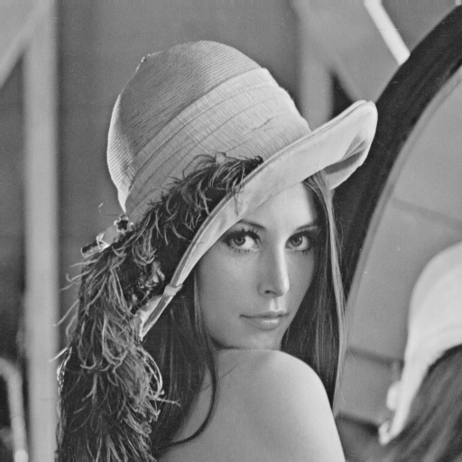
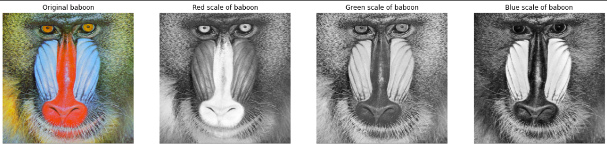
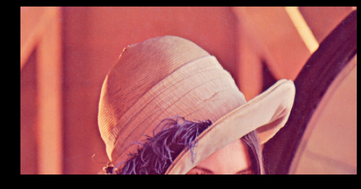
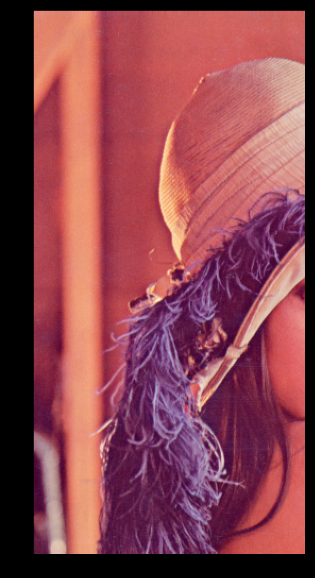

Digital images are fundamental to computer vision and image processing. In this guide, we'll explore what digital images are, how they're represented in memory, and how to manipulate them using two popular Python libraries: PIL (Pillow) and OpenCV.

## What is a Digital Image?

A digital image can be interpreted as a rectangular array of numbers. When we zoom into any image, we see it's comprised of a rectangular grid of blocks called **pixels** (picture elements). Each pixel is represented by numerical values called **intensity values**.

### Grayscale Images

For grayscale images, pixels are represented by a single intensity value ranging from 0 to 255:
- **0** represents black
- **255** represents white
- Values in between represent different shades of gray

The **contrast** of an image is determined by the difference between these intensity values. Interestingly, 256 different intensity levels are sufficient to represent images that appear smooth to the human eye.

When we reduce the number of intensity levels, image quality degrades:
- 256 levels: Full quality image
- 32 levels: Still looks similar
- 16 levels: Noticeable differences in low-contrast regions
- 8 levels: Image looks degraded
- 2 levels: Image appears cartoon-like

### Image Structure

A digital image has:
- **Height**: Number of rows
- **Width**: Number of columns
- **Indexing**: Each pixel has row and column coordinates
  - Rows start at the top and increase downward
  - Columns start at the left and increase rightward

### Color Images (RGB)

Color images are represented as a combination of three channels:
- **Red channel** (index 0)
- **Green channel** (index 1)
- **Blue channel** (index 2)

If a grayscale image is like a square array, a color image is like a cube with three layers (channels). Each channel has its own set of intensity values from 0 to 255.

### Image File Formats

Common image formats include:
- **JPEG** (Joint Photographic Expert Group): Lossy compression, smaller file sizes
- **PNG** (Portable Network Graphics): Lossless compression, supports transparency

## Working with PIL (Pillow)

PIL (Python Imaging Library), now maintained as Pillow, is a popular library for basic image operations in Python.

### Installation and Setup

```python
# Install required libraries
!pip install Pillow
!pip install matplotlib

# Import necessary modules
from PIL import Image, ImageOps
import matplotlib.pyplot as plt
import os
import numpy as np
```

### Loading Images

```python
# Define image path
my_image = "lenna.png"
cwd = os.getcwd()
print("Current directory: ", cwd)

# Use os.path.join() for cross-platform compatibility
# Windows uses backslash (\), Linux uses forward slash (/)
image_path = os.path.join(cwd, my_image)
print("Image whole path: ", image_path)

# Load the image
image = Image.open(image_path)
print(type(image))  # <class 'PIL.PngImagePlugin.PngImageFile'>
```

### Displaying Images

```python
# Display image using matplotlib
plt.figure(figsize=(10,10))
plt.imshow(image)
plt.show()
```

### Image Attributes

```python
# Check image properties
print("Format:", image.format)    # File format (e.g., 'PNG')
print("Size:", image.size)        # (width, height) in pixels
print("Mode:", image.mode)        # Color space (e.g., 'RGB')
```

### Grayscale Conversion



```python
# Convert to grayscale to reduce file size
image_gray = ImageOps.grayscale(image)
print("Grayscale mode:", image_gray.mode)  # 'L' for luminance

# Display grayscale image
plt.figure(figsize=(10,10))
plt.imshow(image_gray, cmap='gray')
plt.show()
```

### Quantization


Quantization reduces the number of intensity levels, which can significantly reduce file size:

```python
# Reduce intensity levels
quantized_drastic = image_gray.quantize(2)      # Only 2 levels (black/white)
quantized_image = image_gray.quantize(256//2)   # 128 levels

# Compare different quantization levels
fig, axes = plt.subplots(1, 3, figsize=(15,5))

axes[0].imshow(image_gray, cmap='gray')
axes[0].set_title("Original Image (256 levels)")
axes[0].axis('off')

axes[1].imshow(quantized_image.convert('RGB'))
axes[1].set_title("Quantized (128 Levels)")
axes[1].axis('off')

axes[2].imshow(quantized_drastic.convert('RGB'))
axes[2].set_title("Quantized (2 levels)")
axes[2].axis('off')

plt.show()
```

The `convert('RGB')` method converts the quantized image back to RGB mode for display purposes.

### Working with Color Channels



```python
# Load a color image
baboon = Image.open('baboon.png')

# Split into separate R, G, B channels
red, green, blue = baboon.split()

# Visualize each channel
fig, axes = plt.subplots(1, 4, figsize=(20,5))

axes[0].imshow(baboon)
axes[0].set_title("Original baboon")
axes[0].axis('off')

axes[1].imshow(red, cmap='gray')
axes[1].set_title("Red channel")
axes[1].axis('off')

axes[2].imshow(green, cmap='gray')
axes[2].set_title("Green channel")
axes[2].axis('off')

axes[3].imshow(blue, cmap='gray')
axes[3].set_title("Blue channel")
axes[3].axis('off')

plt.show()
```

Note: In grayscale channel visualizations, brighter regions indicate higher intensity in that particular color channel.

### Converting PIL Images to NumPy Arrays

```python
# Convert PIL image to NumPy array
image_array = np.array(image)
print("Type:", type(image_array))  # <class 'numpy.ndarray'>
print("Shape:", image_array.shape)  # (height, width, channels)
print("Min value:", image_array.min())
print("Max value:", image_array.max())
```

NumPy arrays provide more flexibility for mathematical operations and are compatible with many computer vision libraries.

### Image Slicing and Cropping



```python
# Crop vertically (keep top 256 rows)
rows = 256
plt.figure(figsize=(10,10))
plt.imshow(image_array[0:rows, :, :])
plt.show()
```


```python
# Crop horizontally (keep left 256 columns)
columns = 256
plt.figure(figsize=(10,10))
plt.imshow(image_array[:, 0:columns, :])
plt.show()
```

The slicing notation `[row_start:row_end, col_start:col_end, :]` allows you to extract specific regions:
- First dimension: row indices (vertical)
- Second dimension: column indices (horizontal)
- Third dimension: color channels (use `:` to keep all channels)

### The Importance of Copying

When working with arrays, understanding the difference between reference and copy is crucial:

```python
# Create a proper copy
A = image_array.copy()

# This creates a reference, NOT a copy
B = A

# Modifying A will also modify B (they point to the same memory)
A[:, :, :] = 0

plt.figure(figsize=(10,10))
plt.imshow(B)  # B is also all black now!
plt.show()
```

Always use `.copy()` when you want to preserve the original image while making modifications.

### Channel Manipulation

```python
# Keep only the red channel
baboon_array = np.array(baboon)
baboon_red = baboon_array.copy()

baboon_red[:, :, 1] = 0  # Remove green channel
baboon_red[:, :, 2] = 0  # Remove blue channel

fig, axes = plt.subplots(1, 2, figsize=(10,5))

axes[0].imshow(baboon)
axes[0].set_title("Original baboon")
axes[0].axis('off')

axes[1].imshow(baboon_red)
axes[1].set_title("Red channel only")
axes[1].axis('off')

plt.show()
```

## Working with OpenCV

OpenCV (Open Source Computer Vision Library) is a more powerful library for computer vision tasks, offering extensive functionality beyond basic image manipulation.

### Installation and Setup

```python
# Install OpenCV
!pip install opencv-python-headless
!pip install matplotlib

# Import OpenCV
import cv2
import matplotlib.pyplot as plt
```

### Loading Images with OpenCV

```python
# Load image (returns NumPy array directly)
image = cv2.imread("lenna.png")
print(type(image))  # <class 'numpy.ndarray'>
print("Shape:", image.shape)  # (height, width, channels)
```

### Critical Difference: BGR vs RGB

OpenCV uses BGR (Blue-Green-Red) color order instead of RGB:

```python
# Display without conversion shows wrong colors
plt.figure(figsize=(10,10))
plt.imshow(image)  # Colors look wrong!
plt.show()

# Convert BGR to RGB for proper display
new_image = cv2.cvtColor(image, cv2.COLOR_BGR2RGB)

plt.figure(figsize=(10,10))
plt.imshow(new_image)  # Now colors are correct
plt.show()
```

This is the main difference between PIL and OpenCV:
- **PIL**: Uses RGB order
- **OpenCV**: Uses BGR order
- **Matplotlib**: Expects RGB order for display

Always convert OpenCV images to RGB before displaying with matplotlib.

### Grayscale Conversion in OpenCV

```python
# Convert to grayscale
image_gray = cv2.cvtColor(image, cv2.COLOR_BGR2GRAY)
print("Grayscale shape:", image_gray.shape)  # (height, width) - only 2D

plt.figure(figsize=(10,10))
plt.imshow(image_gray, cmap='gray')
plt.show()
```

You can also load images as grayscale directly:

```python
# Load as grayscale from the start
im_gray = cv2.imread('barbara.png', cv2.IMREAD_GRAYSCALE)

plt.figure(figsize=(10,10))
plt.imshow(im_gray, cmap='gray')  # Must specify cmap='gray' for grayscale
plt.show()
```

Note: Without `cmap='gray'`, matplotlib will apply a random colormap to 2D arrays.

### Channel Slicing in OpenCV

Remember that OpenCV uses BGR order:

```python
# Load image
baboon = cv2.imread('baboon.png')

# Extract individual channels (BGR order!)
blue = baboon[:, :, 0]   # Blue channel
green = baboon[:, :, 1]  # Green channel
red = baboon[:, :, 2]    # Red channel

# Display all channels
fig, axes = plt.subplots(1, 3, figsize=(15,5))

axes[0].imshow(blue, cmap='gray')
axes[0].set_title("Blue channel")

axes[1].imshow(green, cmap='gray')
axes[1].set_title("Green channel")

axes[2].imshow(red, cmap='gray')
axes[2].set_title("Red channel")

plt.show()
```

### Isolating Color Channels

Method 1: Working directly with BGR (then convert for display):

```python
baboon_red = baboon.copy()
baboon_red[:, :, 0] = 0  # Remove blue
baboon_red[:, :, 1] = 0  # Remove green

plt.figure(figsize=(10,10))
plt.imshow(cv2.cvtColor(baboon_red, cv2.COLOR_BGR2RGB))
plt.show()
```

Method 2: Convert to RGB first, then manipulate:

```python
baboon = cv2.imread('baboon.png')
baboon_rgb = cv2.cvtColor(baboon, cv2.COLOR_BGR2RGB)

baboon_blue = baboon_rgb.copy()
baboon_blue[:, :, 0] = 0  # Remove red (now in RGB order)
baboon_blue[:, :, 1] = 0  # Remove green

plt.figure(figsize=(10,10))
plt.imshow(baboon_blue)
plt.show()
```

## PIL vs OpenCV

| Feature | PIL/Pillow | OpenCV |
|---------|-----------|---------|
| **Color Order** | RGB | BGR |
| **Loading** | `Image.open()` returns PIL object | `cv2.imread()` returns NumPy array |
| **Ease of Use** | Simpler, more intuitive | More complex but powerful |
| **Functionality** | Basic image operations | Extensive CV algorithms |
| **Array Type** | Needs conversion to NumPy | Native NumPy arrays |
| **Best For** | Simple tasks, quick prototypes | Advanced CV, real-time processing |
