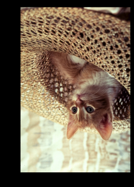
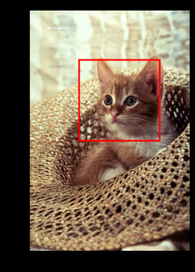

In the previous post, we covered the fundamentals of digital images and how to load them using PIL. Now, we're going to step up our game. We will move beyond simple display and look into how computers actually store images in memory, how to manipulate them mathematically using matrix operations, and how to use **OpenCV**, the industry-standard library for computer vision.

# The Memory Trap: Aliasing vs. Copying

One of the most common bugs in image processing comes from misunderstanding how Python handles arrays in memory. Since images are essentially large arrays of numbers, assigning them to a new variable doesn't create a new image—it just creates a new "label" for the same data.

## The "Shallow" Copy Problem

```python
import numpy as np
from PIL import Image
import matplotlib.pyplot as plt

# Load image and convert to array
img = Image.open('baboon.png')
img_array = np.array(img)

# Just assigning the variable (Reference)
A = img_array 

# If we modify A...
A[:, :, :] = 0  # Turn everything black

# ...the original img_array is ALSO destroyed!
print("Are they the same object?", id(A) == id(img_array)) # True
```

## Sol : Deep copy
```python
# Proper Deep Copy
B = img_array.copy()

# Now B is safe from changes made to img_array
print("Are they the same object?", id(B) == id(img_array)) # False
```

# Geometric Transformations
While libraries provide simple functions like .flip(), understanding the matrix logic behind them helps when you need to build custom filters.



## Manual Flipping (Matrix Indexing)
Let's flip an image vertically without using a built-in function. We map the first row of the original image to the last row of the new image.
```python 
height, width, channels = img_array.shape
array_flip = np.zeros_like(img_array)

for i, row in enumerate(img_array):
    # Map row i to row (height - 1 - i)
    array_flip[height - 1 - i, :, :] = row

plt.imshow(array_flip)
plt.show()
```

## The Easy Way (Transpose & Flip)
Of course, libraries offer optimized ways to do this.
```python 
# Pillow 
from PIL import ImageOps

im_flip = img.transpose(Image.FLIP_TOP_BOTTOM)
# or
im_mirror = ImageOps.mirror(img)
```

OpenCV uses a simple integer code for flipping:
- 0: Vertical flip
- 1: Horizontal flip
- -1: Both

```python 
import cv2
# OpenCV flipping
flip_vertical = cv2.flip(img_array, 0)
```

# Drawing and Text Overlay
Image processing isn't just about analyzing pixel values; it's often about annotating them. Using PIL's ImageDraw, we can modify images directly.

## Drawing Shapes and Text
A common issue with ImageDraw.text is that the default font is tiny. To fix this, we load a specific TrueType font.




```python 
from PIL import ImageDraw, ImageFont

# Create a copy to draw on
image_draw = img.copy()
draw = ImageDraw.Draw(image_draw)

# Load a font (You might need to download a .ttf file first)
# Here we set the size to 50 for visibility
try:
    font = ImageFont.truetype("RobotoSlab-Bold.ttf", size=50)
except:
    font = ImageFont.load_default()

# Draw a red rectangle (outline only)
# Coords: [left, top, right, bottom]
box = [150, 150, 400, 400] 
draw.rectangle(xy=box, outline="red", width=5)

# Add Text
draw.text(xy=(150, 100), text="Target", fill="black", font=font)

plt.imshow(image_draw)
plt.show()
```

# Opencv : Channel splitting and merge
OpenCV allows you to dismantle an image into its color components and reassemble them. This is how we can verify the BGR structure.

```python
# Split channels (Remember: B, G, R order)
blue, green, red = cv2.split(image_cv)

# If we merge them back in reverse order (R, G, B), 
# we create a valid RGB image manually without cvtColor
image_merged = cv2.merge([red, green, blue])

plt.imshow(image_merged)
plt.show()
```