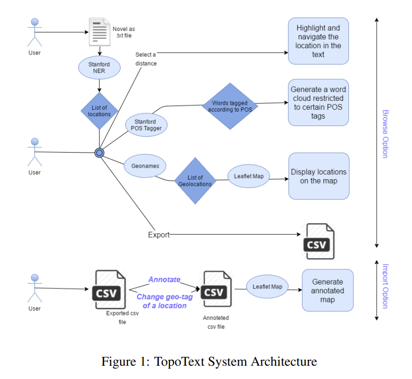
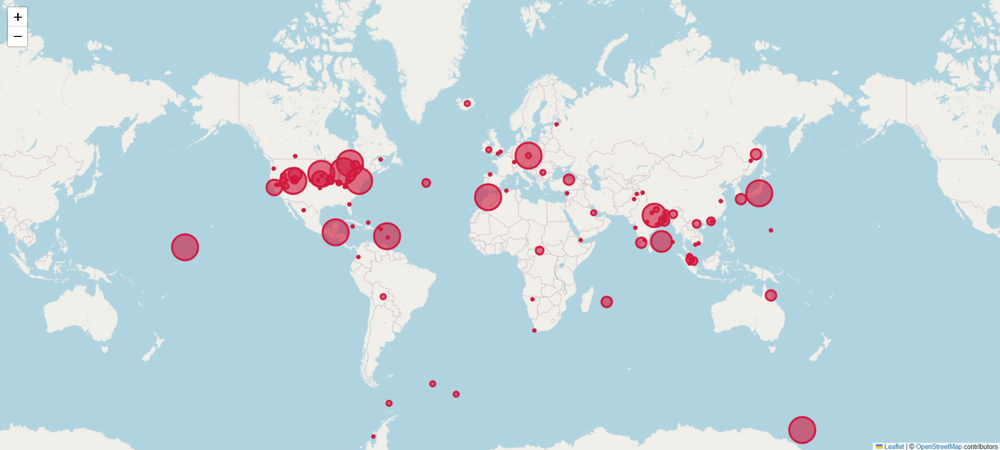
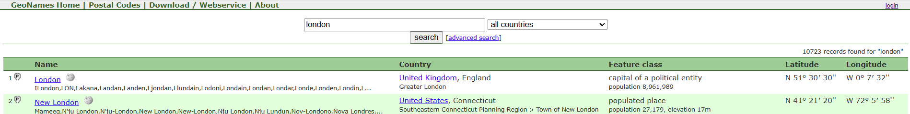

> COLING 2016. [[Paper](https://aclanthology.org/C16-2040.pdf)] [[GitHub](https://github.com/rkhatib/topotext)]  
> Ramy Khatib, Julia Makhalova, Shady Elbassuoni  
> American University of Beirut  
> 13 Dec 2016

# Motivation
This study aimed to overcome the limitations of existing literary map mapping, which primarily consists of simple location display (static plotting), making it difficult to determine the importance (frequency) of a location within the text or the context in which it was used.

# Methodology 


1. txt -> extract locations with CoreNLP -> count frequencies -> save as JSON

```
{"Gardens": 1, "Saville": 14, "Row": 10, "Pall": 3, "Mall": 3, "Rothal": 2, "Great": 10, "Peninsula": 2, "Railway": 3, "Yokohama": 40, "Fallentin": 1, "Sydenham": 1, "West": 2, "End": 1, "Europe": 13, "ROWAN": 1, "Peninsular": 2, "Canal": 1, "Cape": 1, "Red": 3, "Sea": 4, "Atlantic": 12, "Africa": 3, "Arabic": 1, "Gulf": 2, "Benares": 9, "Bab": 1, "-": 3, "el": 1}
```
The location output looks like this. 
But you can already see a few errors:
- Non-locations: "el", "-", "Railway", "Red"
- Parsing error: "Saville" and "Row" (the actual name is “Saville Row”)

This happens because the engine is dated I’ll revisit it in the limitations section below. 

In 2016, Stanford CoreNLP was still one of the strongest options available.
It relies on CRF (Conditional Random Fields), a statistical model, rather than modern deep learning approaches like BERT. As a result, non-locations can be extracted as locations. 
Also, it’s implemented in Java and runs on CPU/RAM only (no GPU), which makes it quite slow. 

2. Take the JSON from step 1 and query [Geonames](https://www.geonames.org/). 


As shown, each place returns latitude/longitude, which is used in the next step to map locations. 
You can also see basic metadata for each place. 

We consolidate everything and store it as a CSV file. 

```
Location,Resolved_Name,Country,Lat,Lng,Frequency,Annotation
Gardens,Singapore Botanic Gardens,Singapore,1.31028,103.81639,1,
Saville,Saville Lake,Canada,47.61848,-81.27189,14,
Row,Row Island,Antarctica,-66.51667,162.63333,10,
Pall,Lac Pall,Canada,47.09528,-78.28972,3,
Mall,Hougang Mall,,1.37249,103.89348,3,
Great,Great Lakes Region,United States,44.57143,-84.69022,10,
Peninsula,Balkan Peninsula,,44,23,2,
```

It ends up stored like this. 

The `Annotation` column enables a human-in-the-loop step, allowing manual corrections on the location, metadata, and frequency. 

3. With coordinates, place names, and frequencies, we can plot them on a map. 
They use Leaflet, a mobile-friendly open-source JavaScript library. 



As you can see, the marker size varies based on frequency in the input text. 

In short, given a full text, the system maps the most frequently mentioned places onto a static map. 

# Limitations

- CoreNLP extracts locations from text, but Stanford NER uses CRF (not modern deep learning such as BERT), so non-locations can be incorrectly labeled as locations. 
- CoreNLP is CPU/RAM-bound, so it becomes slow as the input grows.
- Disambiguation for identical place names is weak. 


For example, “London” could be London (UK) or London (Connecticut, USA). The paper defaults to the first result, and correcting this requires manual labeling. 

- Naive extraction: if the input sentence is “I’m in London now, but I miss the bread I ate in Paris three years ago,” the system will plot Paris even though the focus is London.
- Fictional settings don’t work. Only real-world places on Earth are supported (a scalability issue). What about sci‑fi or fantasy?
- No time axis: there is no animation of movement over time. It simply maps frequency from the full text onto a static map. 

# Conclusion
This was my first paper research for my research, but it was so outdated that I couldn't find any useful insights...
