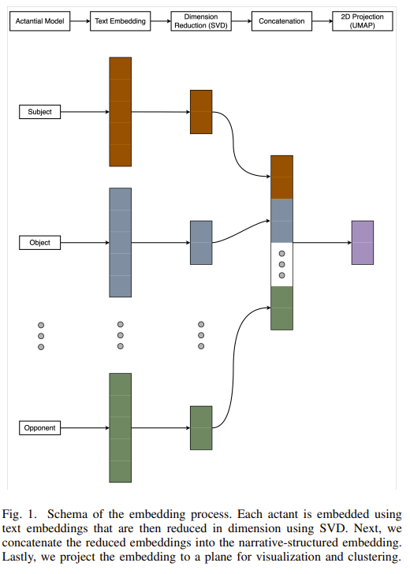
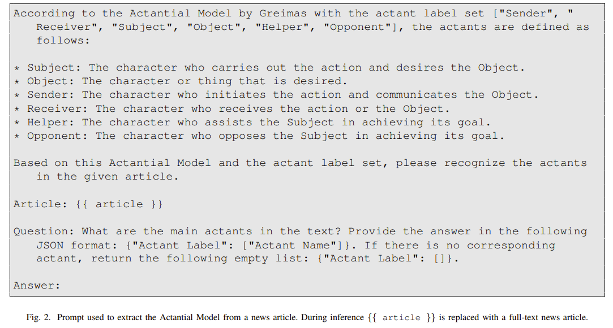
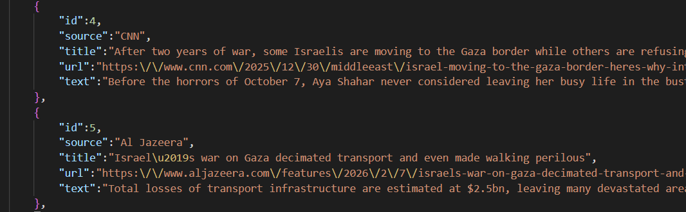
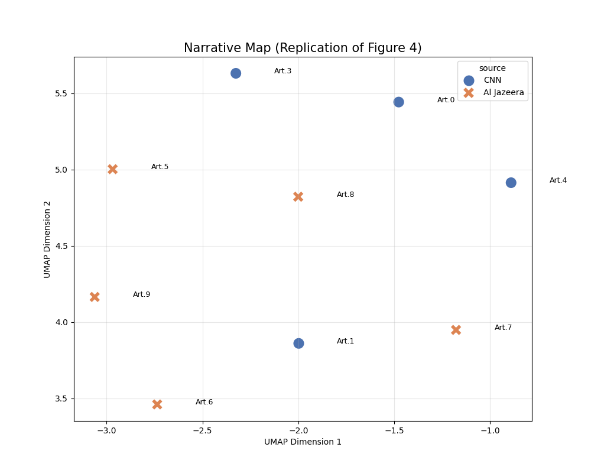
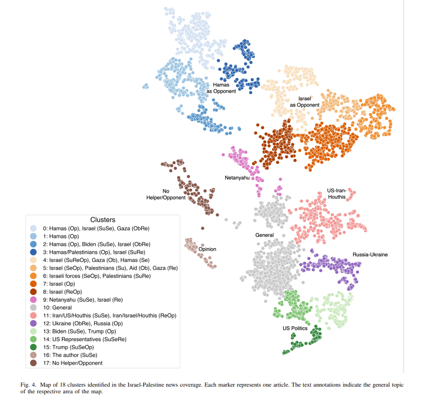
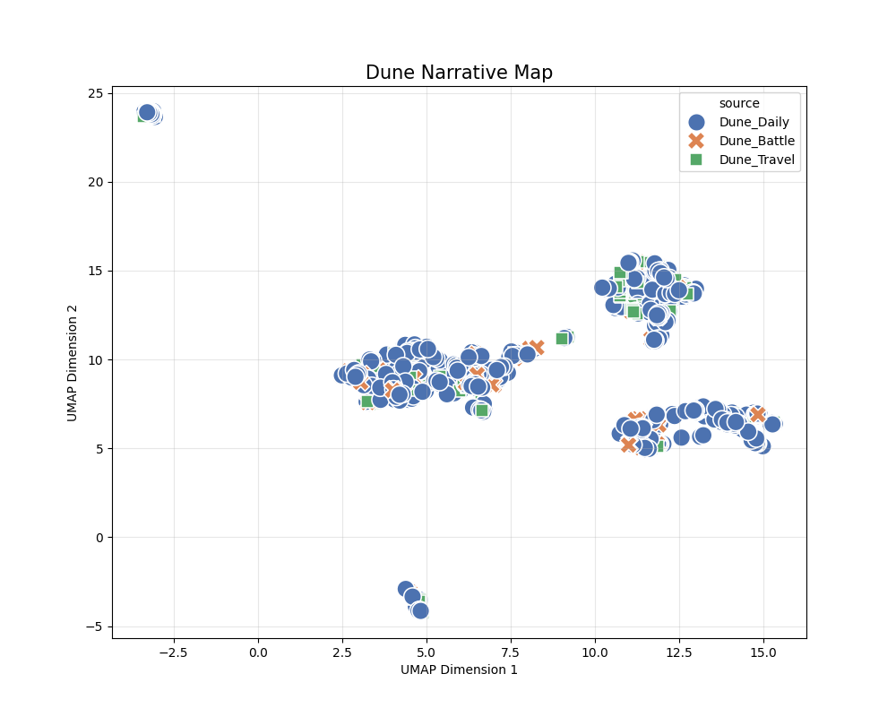
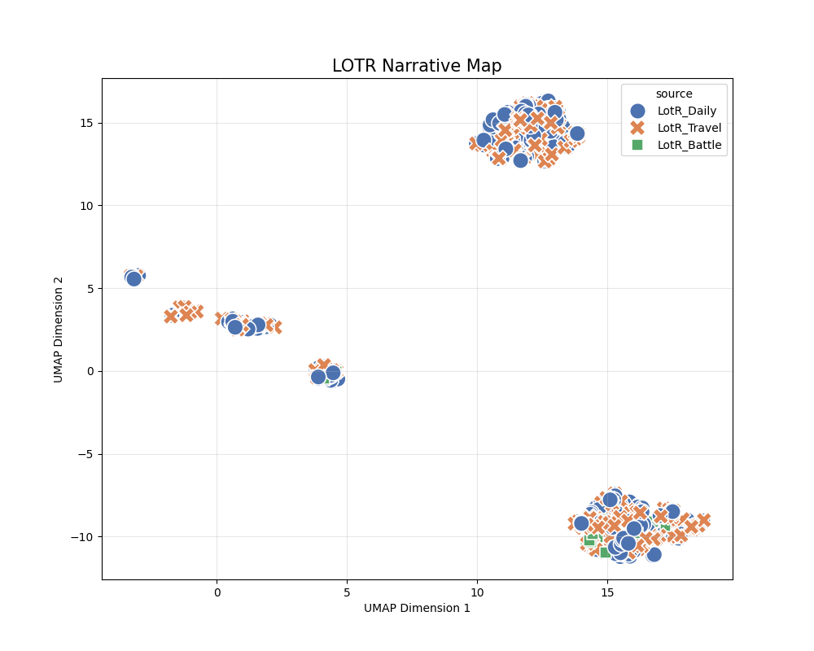

> ACM 2025 [[Paper](https://arxiv.org/html/2409.06540v1)] [[GitHub](https://github.com/jelfes/llam)]  
> Jan Elfes  
> University College Dublin  
> 10 Sep 2024

# Motivation w short solution
## Limitations of keyword-based semantic similarity

The paper uses Israel–Gaza war articles as an example, so I’ll use the same setting here.

- "The Israeli army killed terrorists in Gaza."
- "The Israeli army massacred civilians in Gaza."

As you can see, the phrasing carries subtle cues about the writer’s stance (narrative). However, with keyword-based similarity, the overlap in terms like `Israeli army`, `Gaza`, and `killed/massacred` makes the two sentences look highly similar.

In other words, it has been hard to precisely model and quantify the nuance in *who* did *what* to *whom*.

To address this, the paper adopts the Actantial Model (Greimas, 1996) and structures narratives into roles, enabling narrative-aware classification.

## Contribution to quantitative analysis

There wasn’t a scalable, automated way to analyze thousands of articles quantitatively. This paper proposes a pipeline that uses an LLM (Llama) to extract six actant roles based on Greimas’ framework, then performs semantic analysis while preserving meaning as much as possible.

# Methodology



Let’s walk through the architecture.

## 1. Actantial model
- Feed crawled articles into an LLM (Llama-3-8B-Instruct) and extract six actant roles.

The prompt is as follows.


## Reproduction


The output looks like this.
- Crawling The Washington Post kept getting blocked, so I used CNN instead.
- Due to broken links and crawling blocks, I manually collected five relevant articles each from CNN and Al Jazeera.

```json
{
    "id": 0,
    "source": "CNN",
    "actants": {
        "Sender": [
            "Eyal Eshel",
            "Rafi Ben Shitrit"
        ],
        "Receiver": [
            "Prime Minister Benjamin Netanyahu",
            "The government",
            "The public"
        ],
        "Subject": [
            "Eyal Eshel",
            "Rafi Ben Shitrit",
            "The October Council"
        ],
        "Object": [
            "Truth",
            "Accountability",
            "Investigation"
        ],
        "Helper": [
            "The October Council",
            "Bereaved families",
            "Survivors"
        ],
        "Opponent": [
            "Prime Minister Benjamin Netanyahu",
            "The government"
        ]
    }
}
```
This is one example JSON output, where a single article is split into six actant roles.

## 2. Embedding

- Embed the extracted actants into 1024-dimensional vectors.
    - I use **e5-large**, a BERT-family model. GPT-style models are strong at generation, but BERT-style models are typically more cost-effective for embeddings.

## 3. SVD

- Apply SVD separately for each of the six roles, preserving order and role identity.
    - SVD (Singular Value Decomposition) compresses the 1024-d space to its most informative core signal.

## 4. Concatenation

- After dimensionality reduction, concatenate the six role vectors into one long vector.
- I avoid mean pooling because summation destroys order information. ("Israel (Subject) attacks Gaza (Object)" vs. "Gaza (Subject) attacks Israel (Object)" become identical if you simply add vectors.)


## 5. 2D projection (UMAP)
- Final vector size = reduced SVD dimension (34 in the paper) × 6
    - That is, 204 dimensions per article
- **UMAP** is a non-linear projection that flexibly preserves distances.
    - **SVD** is a linear projection that captures directions explaining the largest variance.
    - Since UMAP can become unreliable in very high dimensions, SVD is applied first as an intermediate step.



I only used 10 articles, so the plot is much smaller than the paper’s figure, but the clustering still works reasonably well.

# Experiments & Results


The paper collected 5,342 news articles and split them into 18 classes.
> 5342 news articles on the Israel-Palestine conflict, sourced from Al Jazeera
and The Washington Post

As the figure shows, semantic distances separate cleanly with minimal overlap.

# Additional study
To gain insight for my own research, I ran additional experiments.

## Motivation

**To use the paper’s idea as a justification and baseline for my research, I designed an additional experiment:**

I applied the method to long-context novels. The key question was:

- Can the approach still compare narratives effectively for long text, not just short news articles?

To test generalization, I ran experiments on three popular English novels:

- *Harry Potter 1*
- *LOTR 1*
- *DUNE 1*

For narrative labels, I used three coarse themes—**Battle**, **Daily**, and **Travel**—and included the definitions in the prompt.

```python
prompt_template = """
    Classify the following novel excerpt into one of these categories:
    1. "Battle": Fighting, danger, war, tension, sandworm attack.
    2. "Daily": Dialogue, politics, philosophy, rest.
    3. "Travel": Moving, desert crossing, ornithopter flight.
    
    Excerpt: "{text}"
    
    Question: Is this 'Battle', 'Daily', or 'Travel'? Answer with one word.
    Answer:"""
```

- Chunk length = 1,500 characters (~200–300 words)
    - A typical novel page is about 1,500 characters
    - e5-large has an input token limit (roughly 350–450)
    - I used a 200-character overlap to reduce context loss
        - e.g., 0–1500, then 1300–2800, etc.
    - Chunks shorter than 1,500 characters were discarded

All other experiment settings (architecture, reduced dimension size, etc.) matched the paper.

 

The results are below.

- Results
    
    
    
    
    
    
    

As shown, the clusters do **not** split cleanly into three groups as intended.

Possible causes include the following.

- Sparse vectors
    - In the novel experiments, it was rare for all six actant roles to be filled for each of the three clusters.
    - Examples:
        - Travel: `Subject` exists, but `Opponent` or `Receiver` are often empty.
        - Daily: `Subject` and `Receiver` exist, but `Object` or `Opponent` are often empty.
    - This creates many near-empty **null actants**, which add noise during embedding.
- Limitations of embeddings themselves
    - Ideal case: (Harry vs. Malfoy) and (Harry vs. Voldemort) should both map to **Battle** because they share the same action structure.
    - In practice, the embeddings for “Malfoy” and “Voldemort” are far apart, so the scenes appear distant despite being the same narrative type.

To analyze this further (using **Harry Potter** as the reference), I ran two focused checks:

- **Class A:** Why are some samples *close* despite being in the same cluster?
- **Class B:** Why are some samples *far* despite being in the same cluster?

I computed similarity in the concatenated vector space **before** UMAP. Compressing to 2D can destroy information, so it is not a reliable similarity measure.

- 34 dimensions (SVD) × 6 roles = 204-dimensional similarity check
- Euclidean distance (L2)
- Only the **Battle** cluster
- Selected 2 samples from Class A and 2 from Class B, then prompted **Meta-Llama-3.1-8B-Instruct**.
    - Full prompt
        
        ```python
        prompt_content = f"""
            Analyze why these two '{TARGET_CATEGORY}' scenes are {label.upper()} in vector space.
            
            [Scene A] (ID: {id1})
            - Actants: {json.dumps(act1, indent=2)}
            - Text: "{art1['text'][:300]}..."
            
            [Scene B] (ID: {id2})
            - Actants: {json.dumps(act2, indent=2)}
            - Text: "{art2['text'][:300]}..."
            
            [Task]
            Explain the distance ({dist:.2f}) based on:
            1. Entity Overlap (Do they share same character names?)
            2. Structural Patterns (Are the same roles filled/empty?)
            
            Answer:
            """
        ```
        

**Result analysis**

- Class A: Why are some samples close?
    - DISTANCE: 0.0000
        - One scene is essentially a paraphrase of another, producing near-identical actants (distance ≈ 0).
    - DISTANCE: 0.4148
        - **Scene A Actants:** {"Subject": ["Harry", "Hagrid"], "Object": ["the truth about Harry's parents", "Uncle Vernon"], "Sender": ["Hagrid"], "Receiver": ["Harry", "Uncle Vernon"], "Helper": ["Hagrid"], "Opponent": ["Uncle Vernon"]}

        - **Scene B Actants:** {"Subject": ["Hagrid", "Harry"], "Object": ["Uncle Vernon", "You-Know-Who", "Harry"], "Sender": ["Hagrid"], "Receiver": ["Uncle Vernon", "Harry"], "Helper": ["Hagrid"], "Opponent": ["Uncle Vernon", "You-Know-Who"]}
        - High actant overlap:
            - **Sender**: 'Hagrid' in both scenes.
            - **Receiver**: 'Harry' and 'Uncle Vernon' in both scenes.
            - **Helper**: 'Hagrid' in both scenes.

- Class B: Why are some samples far?
    - **Scene A Actants:** {"Subject": ["Hermione"], "Object": ["the door"], "Sender": ["Hermione"], "Receiver": ["the door"], "Helper": ["Harry"], "Opponent": ["Filch", "Peeves"]}

    - **Scene B Actants:** {"Subject": ["Harry"], "Object": [], "Sender": [], "Receiver": [], "Helper": [], "Opponent": []}
    
    1. **Diverse character involvement**: Scene A involves multiple characters (Hermione, Harry, Filch, Peeves), while Scene B focuses mostly on Harry.
    2. **Different structural roles**: Scene A has a richer actant structure; Scene B has many missing roles.
    3. **Lack of shared context**: The scenes come from different chapters with distinct settings and plot developments (e.g., Chapter 9 vs. Chapter 12).

In short, the **key requirement is that all six actants align**. Because many novel chunks lack full actant sets (especially `Opponent` in Daily/Travel), clean 3-way clustering is hard.

Therefore, a new approach is likely needed for long-context narratives such as novels.


