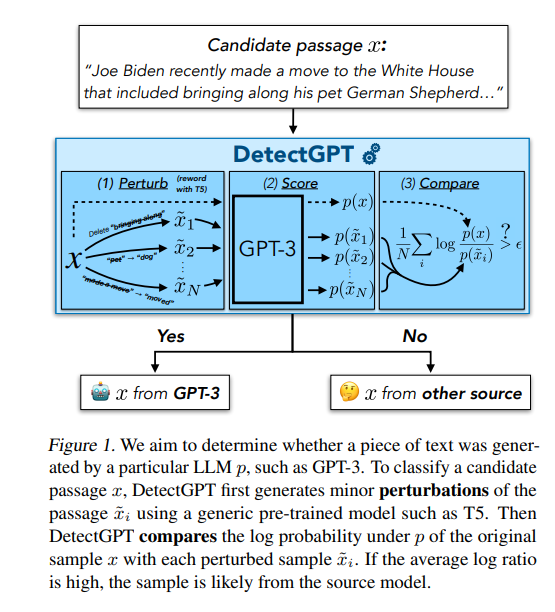
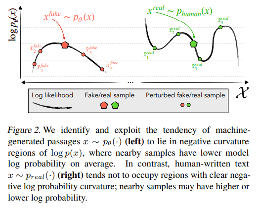
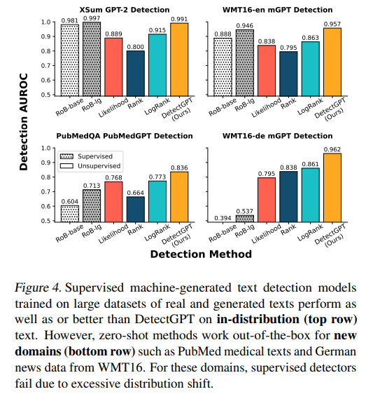
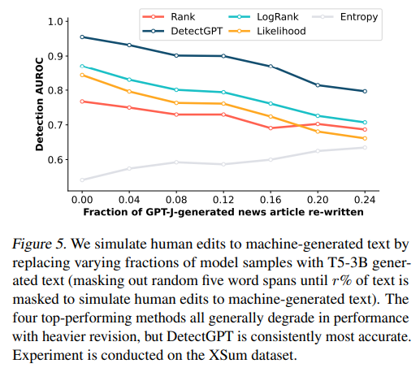

# Motivation

Unfortunately, humans are not good at distinguishing between human-written and machine-generated text

So, we need a new, effective method to distinguish it.

# Common approach in the past

## Train a separate detection model

- these model tends to overfit to the text or the LLM model itself.

## 0th order

Evaluate the mean log probability of the text. 

But, the problem of evaluating mean value is it tends to ignore the local structure. 

and it’s hard to say that it’s accurate itself.

# DetectGPT

$x$ : original text

$\tilde{x}$ : perturbed text

Our goal is to determine whether it’s generated by specific model like GPT-3.

1. $x , \tilde{x}$ are generated.
2. The source model is used to calculate the log probability of both $x, \tilde{x}$ :  $P(x) , P(\tilde{x})$
3. Compare the $P(x)$ with the average log probability of all the perturbed passages

Since, the probability of perturbed passages is in denominator, the bigger the value is, it is highly likely that this passage has made by AI.

---

These are Zero-shot method.

So, you don’t need to train a separate model, nor train it using new datasets, nor watermarking the texts.

---

## Key Concept : Probability Curvature

**AI generated** : AI generated text is so perfect itself, so if you consider the log probability function, AI gen text tends to place at the very top of it. The local maxima.

Since, it is placed in local maxima no matter what perturbation you apply to the text, it must go downwards. (Negative Curvature)

**Human generated** : Human-written text tends not to occupy regions with clear negative log probability curvature. Unlike text generated by a model, it does not necessarily lie at a local maximum of the log probability function.

Therefore, when minor rewrites or "perturbations" are applied to human text, the resulting passages may have either higher or lower log probability than the original sample. In other words, a small change could make the text seem more probable to the model, or less probable.

---

# Evaluation metric(AUROC)

As it shown above, DetectGPT has scored highest AUROC on all the datasets.

---

# Limitations

1. We need an whiteBox model to evaluate an log probability
2. Cost : asking LLM model everytime costs a lot. (API)
3. Partner AI : Usually other LLM model(like T5) makes the perturbation in the text. What if this partner ai misunderstand the text and make some weird perturbation? 
4. Compute-intensive: rather than just the candidate passage, `detectGPT` needs to evaluate all the perturbed sampled text

---

# Future work

- increase robustness : combine detectGPT with watermarking
- How can we use detectGPT in blackBox model?
- can a clever prompting evade a detection using existing methods?

---

# Code

## 1. Sampling

- Human gen text
- AI gen text (using prompt trick)
- combine these two datasets using dataframe and label it.

## 2. Function

- `def get_log_prob`
- `def generate pertubations`

## 3. Experiment

- get one data at a time from dataframe
- evaluate `log_prob score` in original text
- using `perturbation function` generate 10 of perturbed texts. and evaluate the mean value of it.
- evaluate `original - mean of perturbed`

## 4.Conclusion

- So, is it disguinshable?