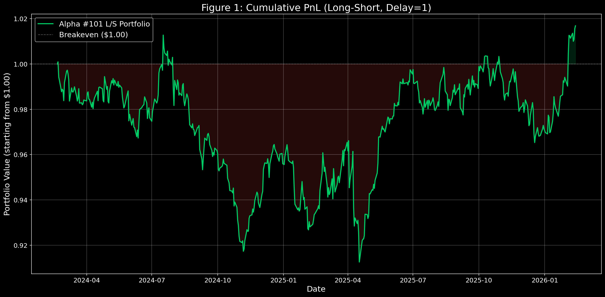
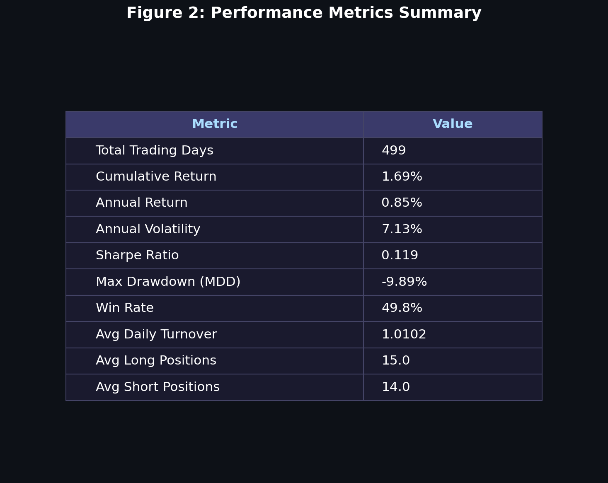
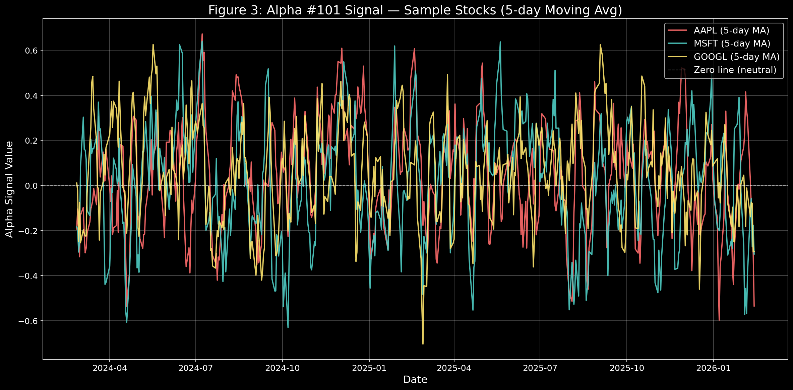
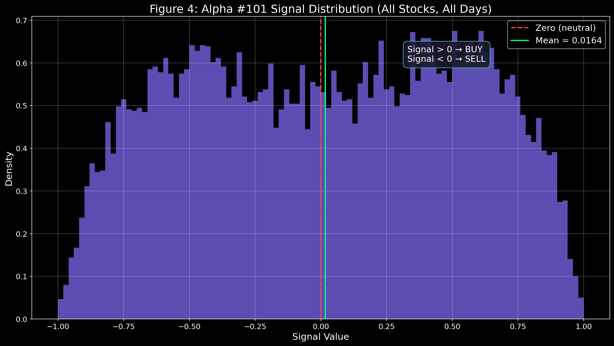
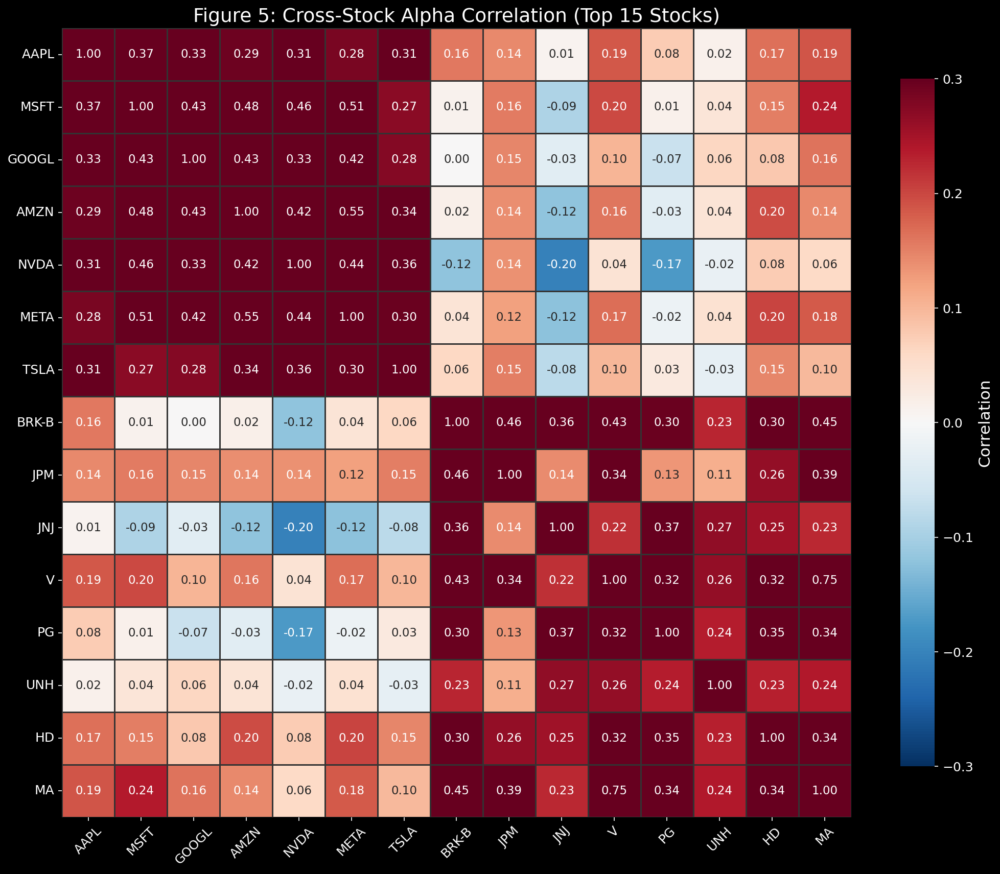
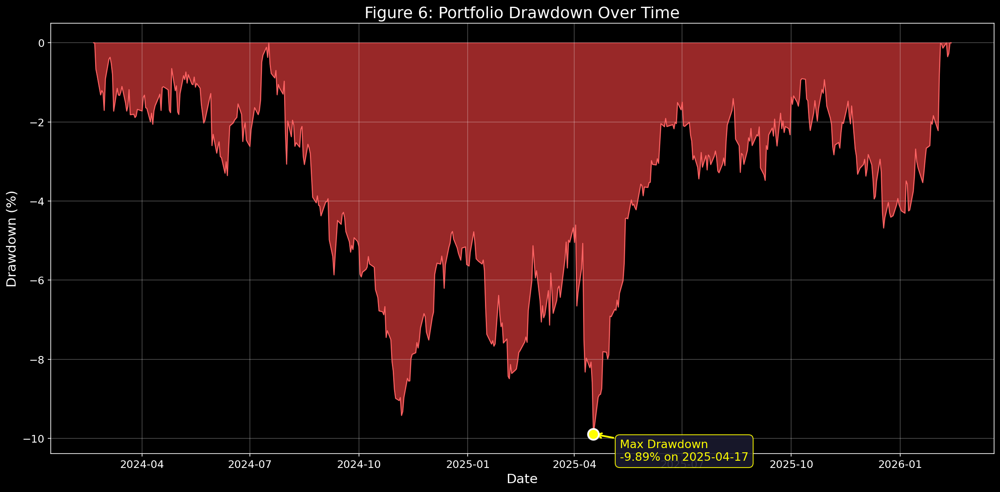

> Wilmott Magazine 2016(84) (2016) 72-80 [[Paper](https://arxiv.org/abs/1601.00991)]  
> Zura Kakushadze

In this post, we examine **Alpha #101** from the paper's collection of 101 formulaic alphas.

---

# Formula

$$\frac{\text{close} - \text{open}}{(\text{high} - \text{low}) + 0.01}$$

- **close − open** : How much did the price rise (or fall) during the day?
- **high − low** : How much did the price fluctuate during the day?
- **+ 0.01** : A small constant to prevent division by zero.

In essence, this alpha measures the **efficiency of the move relative to volatility**.

**High alpha value →**
- The price rose quietly, with little fluctuation.
- A steady, confident upward move — possibly conviction-driven buying.

**Low alpha value →**
- High intraday volatility relative to the net move.
- An unstable, noisy price action.

This alpha can serve as a useful signal for **short-term trading** or **momentum screening**.

## Limitations

- The signal only looks at a **single day's** OHLC data.
- It ignores all other information (volume, news, macro, etc.) and should be combined with other indicators.
- In a regime of **high market-wide volatility**, the interpretation may change significantly.

---

# Experiment

## Setup

| Parameter | Value |
|-----------|-------|
| Universe | Top 30 stocks from the S&P 500 |
| Starting Capital | $1 |
| Period | 499 trading days (~2 years) |

Applying the signal to 30 stocks over ~500 days produces a total of **15,000 alpha signals**.

## Procedure

1. Compute the alpha signal for each stock and **rank** them cross-sectionally.
2. Since close, high, and low prices are only available after market close, the ranking is applied **with a one-day lag**.
3. Go **long** the top 50% and **short** the bottom 50% by rank.
4. Calculate the daily portfolio return across all stocks.
5. Compound the daily returns to get the **cumulative PnL**.

## Results



- The starting point of \$1 is the **break-even** line.
- **PnL** = Profit and Loss



### Key Metrics

- **Total Return: 1.69%** — Quite low, considering bank deposit rates sit around 2–3% annually.
- **Annual Volatility** — How much the portfolio value fluctuated over the year.

### Why Do We Multiply by √N?

This is a fundamental rule in statistics:

$$\sigma_{N\text{-day}} = \sigma_{1\text{-day}} \times \sqrt{N}$$

**Why not just multiply by N?**

```
Daily volatility: 1%

If we simply multiplied:
→ 252-day volatility = 1% × 252 = 252%  (absurd!)

With the square root:
→ 252-day volatility = 1% × √252 = 1% × 15.87 = 15.87%  (realistic)
```

**The underlying principle:**

Daily returns are assumed to be **independent**. Today's +1% doesn't dictate tomorrow's direction — gains and losses can **cancel out** over time.

Mathematically:

$$\text{Var}_{N} = N \cdot \sigma^2 \quad \Rightarrow \quad \text{Std}_{N} = \sqrt{N} \cdot \sigma$$

Variance scales linearly with $N$; standard deviation scales with $\sqrt{N}$.

### Annual Volatility Benchmarks

| Asset | Annual Volatility | Note |
|-------|-------------------|------|
| **S&P 500** | **15–18%** | U.S. large-cap 500 |
| **NASDAQ** | **20–25%** | Tech-heavy, higher swings |
| **KOSPI** | **18–22%** | Korean equity market |
| **Bitcoin** | **80–120%** | Extreme volatility |
| **U.S. Treasuries** | **3–5%** | Very stable |
| **Our Strategy** | **7.13%** | Remarkably low volatility |

### Other Metrics

- **Sharpe Ratio** — Risk-adjusted return:

$$\text{Sharpe} = \frac{\text{Annualized Return}}{\text{Annualized Volatility}}$$

A Sharpe above **1.0** is considered good; above **2.0** is excellent. Our result of **0.119** is very poor.

- **Max Drawdown** — The largest peak-to-trough decline in portfolio value.
- **Win Rate** — Percentage of trading days with a positive return.
- **Avg Daily Turnover** — How much of the portfolio is reshuffled each day.
  - A value of **1.01** means we traded ~101% of the portfolio's value daily. Higher turnover = higher transaction costs.
- **Avg Long / Short Positions** — The average number of stocks held long vs. sold short on any given day.









---

> **Disclaimer:** This post is purely a study note. All investment decisions should be made based on your own research and judgment.
