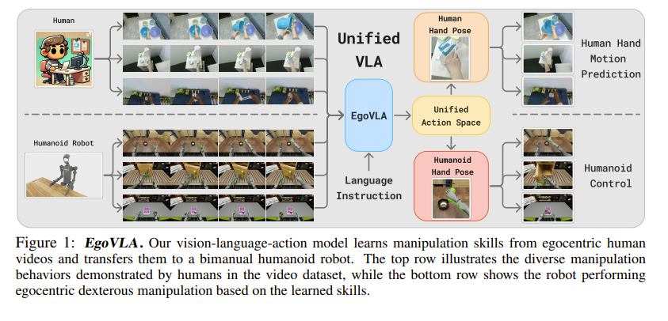
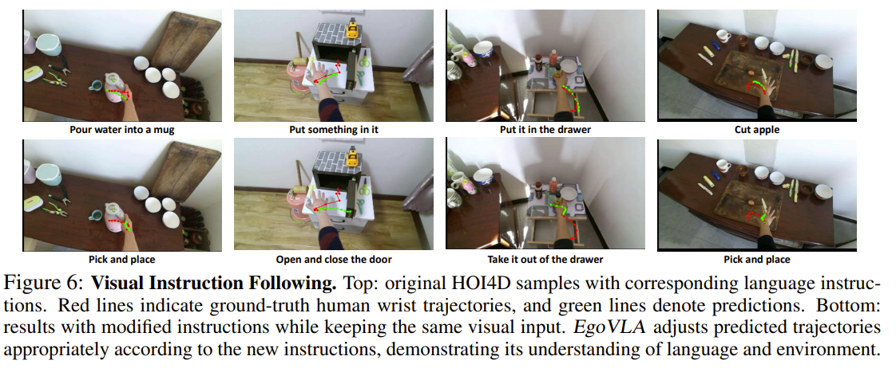
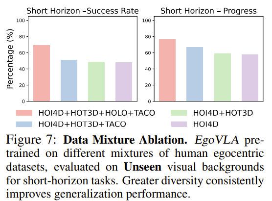
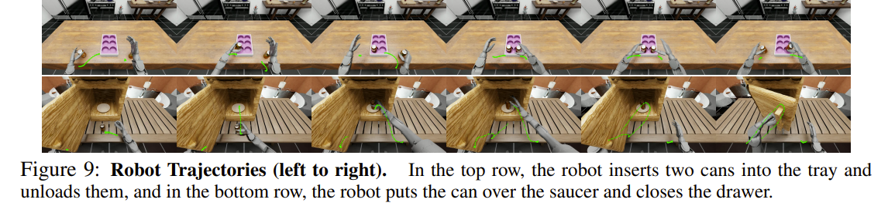

[EgoVLA Paper Link](https://arxiv.org/abs/2507.12440){:target="_blank"}

How can we teach robots complex manipulation skills? Until now, the dominant approach has been to directly operate robots and collect data. However, this method is expensive, and more importantly, it has a fundamental limitation: **you need to have a robot** to collect data in the first place.

But if you think about it, there are already 8 billion “robots” in the world performing all kinds of manipulation tasks every day, in diverse environments. They are **humans**. EgoVLA starts from this idea. If we can learn robot policies from human egocentric videos, wouldn’t we be able to secure not only large-scale data, but also **diversity in tasks and environments**?

## Core Idea

### Why Human Videos?

The problems with robot data collection are clear:
- Requires robots and expert operators
- Time-consuming and costly
- Impossible to collect data in environments robots cannot access
- Complex tasks are hard to capture even with teleoperation

In contrast, human egocentric videos:
- Already exist at large scale
- Cover diverse environments and tasks
- Capture fine-grained hand movements

### Key Insight

The authors’ key observation is the following: **the gap between human and robot action spaces is smaller than expected and can be approximated with a few geometric transformations**.

Based on this, EgoVLA:
1. Trains a **Human VLA** using human egocentric videos
2. Learns to predict wrist positions and hand joint angles
3. Transforms them into the robot action space (inverse kinematics + retargeting)
4. Fine-tunes with a small amount of robot demonstration data

This enables learning manipulation policies without massive robot datasets.

## Methodology

### Overall Pipeline

The training pipeline of EgoVLA consists of three main stages:

```
[Stage 1] Pretraining on human video data
↓
[Stage 2] Unified action space definition
↓
[Stage 3] Fine-tuning with a small amount of robot data
```


### Model Architecture



EgoVLA is built on top of a vision-language model, specifically using **NVILA-2B** as the backbone.

**Inputs:**
- **Visual observations**: current frame + past 5 frames (1 second history, 384×384 resolution)
- **Language instructions**: natural language description of the task
- **Proprioceptive states**: wrist position/rotation, hand joint angles
- **Action query tokens**: special tokens for future action prediction

**Outputs:**
- Wrist pose (3D position + rotation in the camera frame)
- Hand joint parameters (top 15 PCA components of the MANO model)
- 30-step future prediction up to 1 second (30 Hz)

**Action Head:**
- 6-layer transformer (300M parameters)
- Hidden size: 1536
- Simultaneous trajectory prediction for both hands

**Loss Function:**
```
L = λ_wrist_trans * L_wrist_trans + λ_wrist_rot * L_wrist_rot + λ_joint * L_joint
```

- Wrist translation: L2 loss
- Wrist rotation: Rot6D rotation loss
- Hand joints: L2 loss

### Unified Action Space

This is the core design that bridges the gap between humans and robots.


**Robot → Human representation (during training):**

When fine-tuning with robot data, robot actions must be converted into human representations.

1. **Wrist pose**: coordinate alignment via 3D transformation
2. **Hand shape**: MANO parameter optimization

```
minimize L(Θ) = (1/5) * Σ SmoothL1(J_pred(Θ)_i, J_obs,i)
```

- Θ: MANO hand parameters (15D)
- J_pred: fingertip positions from MANO forward kinematics
- J_obs: observed robot fingertip positions (5 × 3D)

**Human → Robot (during inference):**

Predicted human actions are converted back to robot actions.

1. **Wrist → end-effector**: inverse kinematics to compute arm joint angles
2. **Hand shape → robot hand**: lightweight MLP mapping
- Compute 3D keypoints from MANO
- MLP predicts robot hand joint commands
- Fingertip position error: average 5×10⁻⁵ m

Replaying demonstrations through this retargeting pipeline preserves task validity, meaning transformation errors do not significantly affect control performance.

## Dataset

### Human Egocentric Manipulation Datasets

EgoVLA combines four public datasets:

| Dataset | Characteristics | Ratio |
|--------|-----------------|-------|
| **HOI4D** | 4,000 single-hand manipulation videos<br/>Pick-and-place, rotation, articulated objects | 23% |
| **HOT3D** | 833 minutes, 33 rigid objects<br/>Accurate 3D hand/camera poses | 39% |
| **HoloAssist** | 166 hours of complex tasks<br/>Battery replacement, furniture assembly, machine installation<br/>Rich bimanual manipulation (noisy labels) | 25% |
| **TACO** | 2,317 motion sequences<br/>151 tool-action-object combinations | 13% |

**Data Processing:**
- Sampled at 3 FPS (trade-off between efficiency and temporal continuity)
- World-frame camera poses used to project future wrist positions into the current camera frame
- Approximately **500K** image-action pairs in total

Each dataset has strengths and weaknesses, but mixing them:
- Mitigates noise in HoloAssist (1/10 downsampling)
- Compensates for limited language labels in HOT3D
- Achieves balanced coverage of tasks and sources

### Ego Humanoid Manipulation Benchmark

A new simulation benchmark was built for evaluation.

**Platform:**
- NVIDIA Isaac Lab
- Unitree H1 humanoid robot
- Inspire dexterous hands (12 DoF per hand: 6 active + 6 mimic joints)

**Tasks (12 total):**

*Short-horizon (atomic) tasks:*
- Push-Box
- Flip-Mug
- Pour-Balls
- Close-Drawer
- Open-Drawer
- Open-Laptop
- Stack-Can

*Long-horizon (multi-stage) tasks:*
- Sort-Cans
- Insert-Cans
- Unload-Cans
- Insert-And-Unload-Cans
- Stack-Can-Into-Drawer


**Observation and Control:**
- **Observations**: robot joint positions, end-effector poses, contact forces, egocentric RGB-D
- **Control**: end-effector control for arms, PD joint control for hands
- **Action space**: 36D (arm IK + direct hand control)
- **Control frequency**: 30 Hz

**Visual Diversity:**
- 5 room textures × 5 table textures = **25 background combinations**
- Enables robust generalization evaluation

**Demonstrations:**
- Collected using OpenTelevision + Meta Quest 3
- 100 successful demonstrations per task
- Fixed environments: Room 1, 2, 3 + Table 1
- Episode length: 100–500 frames

## Evaluation Metrics

Two main metrics are used:

- **Success Rate (SR)**: overall task success rate
- **Progress Success Rate (PSR)**: fraction of completed subtasks in long-horizon tasks

**Evaluation Setup:**

*Seen environments:*
- Same visual backgrounds as training
- 27 rollouts per task (3 backgrounds × 9 episodes)

*Unseen environments:*
- Completely new backgrounds
- 66 rollouts per task (22 backgrounds × 3 episodes)

Object positions are randomized in all cases (up to 20 cm × 20 cm, unseen during training).

## Experimental Results

### Human Manipulation Modeling

Before robot evaluation, human action prediction was validated.

**Quantitative Results:**
- Average future wrist position error: **8 cm**
- Normalized 2D image-plane error: ~**0.13** (comparable to HOI-forecast)

**Language Understanding:**



Different instructions on the same video lead to different predicted trajectories:
- “Put into the drawer” → “Take out of the drawer”: trajectory shifts from inside to outside
- “Put inside” → “Open and close the door”: object placement changes to door manipulation

EgoVLA learns not just motion, but the **semantic intent of actions**.

### Humanoid Robot Performance

**Baselines:**
- **ACT**: task-specific expert transformers
- **EgoVLA-NoPretrain**: trained only on robot data without human pretraining

#### Short-Horizon Results

**Seen environments:**

| Model | Stack-Can | Push-Box | Open-Drawer | Close-Drawer | Flip-Mug | Pour-Balls | Open-Laptop | Avg SR |
|------|-----------|----------|-------------|--------------|----------|-----------|-------------|--------|
| ACT | 22.22 | 11.11 | 18.52 | 48.15 | 7.40 | 3.70 | 62.96 | 24.87 |
| EgoVLA-NoPretrain | 55.56 | 51.85 | 59.26 | **100.00** | 3.70 | 85.19 | 96.30 | 64.55 |
| EgoVLA | **77.78** | **70.37** | **59.26** | **100.00** | **59.26** | **77.78** | **100.00** | **77.78** |

**Unseen environments:**

| Model | Avg SR | Avg PSR |
|------|--------|---------|
| ACT | 24.89 | 54.22 |
| EgoVLA-NoPretrain | 51.28 | 62.63 |
| EgoVLA | **69.11** | **76.26** |

**Observations:**
- EgoVLA outperforms baselines across all tasks
- Large gains in fine manipulation tasks like Stack-Cans and Flip-Mug
- Robust performance in unseen environments
- EgoVLA-NoPretrain drops 23% in unseen settings, EgoVLA only slightly

#### Long-Horizon Results

**Seen environments:**

| Model | Insert-And-Unload | Stack-Into-Drawer | Sort-Cans | Unload-Cans | Insert-Cans | Avg SR | Avg PSR |
|------|-------------------|-------------------|-----------|-------------|-------------|--------|---------|
| ACT | 0.00 | 11.11 | 0.00 | 0.00 | 0.00 | 2.22 | 26.47 |
| EgoVLA-NoPretrain | 7.41 | 0.00 | 51.85 | 62.96 | 11.11 | 26.67 | 54.93 |
| EgoVLA | **44.44** | **40.74** | **55.56** | **66.67** | **22.22** | **45.93** | **80.78** |

**Unseen environments:**

| Model | Avg SR | Avg PSR |
|------|--------|---------|
| ACT | 0.61 | 23.51 |
| EgoVLA-NoPretrain | 11.21 | 36.20 |
| EgoVLA | **28.79** | **69.11** |

**Key Findings:**
- Generalist models vastly outperform expert models in long-horizon tasks
- Experts struggle with low-level control and long-term planning simultaneously
- Generalists reuse shared low-level skills across tasks
- EgoVLA achieves ~20% higher success than EgoVLA-NoPretrain

### Zero-Shot Transfer Is Not Possible

Interestingly, deploying EgoVLA pretrained on human videos **without robot fine-tuning** yields **0% success** across all tasks.

Reasons include:
- Morphological differences (human vs robot hands)
- Perceptual differences (camera placement, FOV)
- Kinematic differences (joint structures and ranges)

Even tasks seen during pretraining (e.g., pouring balls) fail on robots. **Robot-domain fine-tuning is essential**.

### Ablation Studies

#### Robot Data Scale

Comparison using only 50% of robot demonstrations.

**Short-horizon (Seen):**
- EgoVLA (100%): SR 77.78%
- EgoVLA (50%): SR 48.15%

**Long-horizon (Seen):**
- EgoVLA (100%): SR 45.93%
- EgoVLA (50%): SR 7.41% (significant drop)

**Conclusion:** Human video pretraining helps greatly, but **a sufficient amount of robot demonstrations is still required**.

#### Dataset Mixing



Pretraining with different combinations:

```
HOI4D only
↓ (+HOT3D)
HOI4D + HOT3D
↓ (+TACO)
HOI4D + HOT3D + TACO
↓ (+HoloAssist)
All datasets
```


**Findings:**
- Performance improves with data scale and diversity
- Positive transfer despite noisy labels in HoloAssist
- HOT3D contributes despite limited language annotations
- TACO helps despite limited visual diversity

→ Indicates robustness to dataset imperfections.

#### Spatial Generalization


Success-rate heatmaps over object spawn locations:

**Short-horizon:**
- Higher success near the center
- Stable performance over a wide area

**Long-horizon:**
- Two distinct high-probability regions
- Reflects bimanual manipulation characteristics

EgoVLA remains robust under spatial variations up to 20 cm × 20 cm.

### Trajectory Visualization



Long-horizon execution examples:
- **Top row**: insert two cans into a tray, then unload
- **Bottom row**: place cans on a plate, then close a drawer

With only 100 demonstrations per task, EgoVLA:
- Successfully performs diverse long-horizon tasks
- Exhibits strong spatial and visual generalization
- Generates smooth wrist trajectories

## Limitations and Future Work

### Current Limitations

**1. Pose Annotation Requirement**

Pretraining requires hand and wrist pose annotations, which may limit data availability.

*However…*
- Increasing adoption of AR/VR devices (Quest 3, Vision Pro, Aria Glasses)
- Advances in high-quality hand tracking ease pose data collection

**2. No Zero-Shot Transfer**

Despite unified action space pretraining, robot fine-tuning is still required.

*Future directions:*
- More invariant pretraining strategies
- Improved zero-shot transfer
- Further reduction of robot data requirements

**3. Simulation-Based Evaluation**

The benchmark is simulation-based, and a sim-to-real gap may remain.

*Mitigations:*
- Recent studies show strong correlation between simulation and real-world performance
- Reproducible and cost-effective evaluation
- Modality-invariant methods applicable to real teleoperation data

## Significance and Conclusion

### Main Contributions

**1. New Learning Paradigm**
- Shift from robot-only data to human video utilization
- Large-scale data with diverse tasks and environments

**2. Unified Action Space**
- Alignment between human and robot hand representations
- Enables embodiment transfer

**3. Practical Effectiveness**
- Strong generalization with limited robot data
- Robust to new visual environments and spatial variations

**4. Benchmark Release**
- Ego Humanoid Manipulation Benchmark
- Reproducible evaluation framework

### Key Message

EgoVLA presents a way to **break through the data scale bottleneck** in robot learning. By leveraging rich human manipulation experience and adapting with a small amount of robot data, it offers an efficient and scalable approach.

Although zero-shot transfer is not yet achievable, this work demonstrates:
- Human manipulation knowledge can transfer to robots
- Data diversity is critical for generalization
- Proper embodiment bridging can overcome large gaps

### Looking Forward

This work is a starting point. Future directions include:
- Larger-scale human video datasets
- More effective embodiment bridging techniques
- Real-world robot deployment and validation
- Improved zero-shot transfer capabilities

With continued progress, robots may one day manipulate the world as freely and flexibly as humans.
